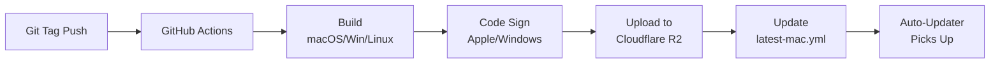

# Release Setup Instructions

## Overview

This document explains how to set up and manage releases for Reliant. Our release system uses:

- **GitHub Actions** for automated builds and publishing
- **Cloudflare R2** for file storage and distribution
- **CloudFlare Workers** for "latest" download URLs
- **Electron Auto-Updater** for automatic updates
- **Apple Code Signing & Notarization** for macOS distribution



## Table of Contents

- [Quick Release Commands](#quick-release-commands)
- [Changelog](#changelog)
  - [Recovering a missed changelog email](#recovering-a-missed-changelog-email)
  - [PR Labels for Changelog](#pr-labels-for-changelog)
- [Download URLs](#download-urls)
- [GitHub Actions Secrets Required](#github-actions-secrets-required)
- [CloudFlare Workers Setup for "Latest" URLs](#cloudflare-workers-setup-for-latest-urls)
- [Setting Up Apple Code Signing](#setting-up-apple-code-signing)
- [Cloudflare R2 Configuration](#cloudflare-r2-configuration)
- [Auto-Updater System](#auto-updater-system)
- [Testing the Release System](#testing-the-release-system)
- [Release Workflow Files](#release-workflow-files)
- [Troubleshooting](#troubleshooting)
- [License Files](#license-files)

## Quick Release Commands

```bash
# Release candidate (prerelease)
make release-rc           # 0.2.3 → 0.2.4-rc1 (first RC)
                          # 0.2.4-rc1 → 0.2.4-rc2 (next RC)

# Patch release (removes RC suffix or increments patch)
make release-patch        # 0.2.4-rc2 → 0.2.4 (stable from RC)
                          # 0.2.4 → 0.2.5 (next patch)

# Minor release
make release-minor        # 0.2.4 → 0.3.0

# Major release
make release-major        # 0.3.0 → 1.0.0
```

These commands use `./scripts/release.sh` to:
1. Update `electron/package.json` version
2. Create a git tag (e.g., `v0.0.1`)
3. Push the tag to trigger GitHub Actions release workflow
4. Build and publish to Cloudflare R2 automatically
5. Make app available for download and auto-update
6. Automatically create PRs when run on main branch

## Changelog

Before creating a release tag, update the changelog:

```bash
# See PRs since last release, grouped by label
make changelog

# Generate a draft YAML entry for the next release
make changelog-draft VERSION=vX.Y.Z
# Optional: pin the comparison base explicitly if needed
make changelog-draft VERSION=vX.Y.Z SINCE_TAG=vX.Y.(Z-1)

# Edit the source of truth
# docs/data/releases/vX.Y.Z.yaml

# Regenerate the Mintlify changelog page
make generate-changelog
```

`scripts/release.sh` now enforces this prerequisite: it refuses to create the release commit/tag unless the matching YAML changelog exists, has a matching `version`, non-empty `title` and `summary`, and at least one item.

### Recovering a missed changelog email

If a release completed but the changelog email did not send, use the manual GitHub Actions workflow `email_changelog` instead of creating another release.

Recommended sequence:

1. Open **Actions** → **email_changelog**
2. Click **Run workflow**
3. Set:
   - `version`: the release tag to send, for example `v1.2.0`
   - `ref`: the branch or commit containing the correct YAML changelog file, usually `main`
   - `dry_run`: `true` first
4. Review the payload preview in the workflow logs
5. Re-run with `dry_run=false` to actually trigger the Customer.io broadcast

Important: this trigger is not idempotent. If Customer.io may already have received the broadcast, check there first to avoid sending the email twice.

For detailed changelog workflow, see [docs/CHANGELOG_GUIDE.md](docs/CHANGELOG_GUIDE.md).

### PR Labels for Changelog

Add one of these labels to each PR:

| Label | Description |
|-------|-------------|
| `changelog:feature` | New functionality |
| `changelog:fix` | Bug fixes |
| `changelog:improvement` | Refactors, UX polish |
| `changelog:breaking` | Breaking changes |
| `changelog:skip` | Internal changes, don't include |

GitHub auto-generates release notes from these labels (configured in `.github/release.yml`).

## Download URLs

After each release, files are available at:

### Versioned URLs (actual files in R2):

**macOS:**
- `https://downloads.reliantlabs.io/Reliant-0.0.3-mac-arm64.dmg`
- `https://downloads.reliantlabs.io/Reliant-0.0.3-mac-x64.dmg`
- `https://downloads.reliantlabs.io/Reliant-0.0.3-mac-arm64.zip`
- `https://downloads.reliantlabs.io/Reliant-0.0.3-mac-x64.zip`

**Linux:**
- `https://downloads.reliantlabs.io/Reliant-0.0.3-linux-x86_64.AppImage`
- `https://downloads.reliantlabs.io/Reliant-0.0.3-linux-arm64.AppImage`
- `https://downloads.reliantlabs.io/Reliant-0.0.3-linux-amd64.deb`
- `https://downloads.reliantlabs.io/Reliant-0.0.3-linux-arm64.deb`

### Latest URLs (CloudFlare Workers redirects):

**macOS:**
- `https://downloads.reliantlabs.io/Reliant-latest-mac-arm64.dmg` ← **Use these for sharing!**
- `https://downloads.reliantlabs.io/Reliant-latest-mac-x64.dmg`
- `https://downloads.reliantlabs.io/Reliant-latest-mac-arm64.zip`
- `https://downloads.reliantlabs.io/Reliant-latest-mac-x64.zip`

**Linux:**
- `https://downloads.reliantlabs.io/Reliant-latest-linux-x86_64.AppImage` ← **Use these for sharing!**
- `https://downloads.reliantlabs.io/Reliant-latest-linux-arm64.AppImage`
- `https://downloads.reliantlabs.io/Reliant-latest-linux-amd64.deb`
- `https://downloads.reliantlabs.io/Reliant-latest-linux-arm64.deb`

The "latest" URLs automatically redirect to the current version, so you never need to update download links.

## GitHub Actions Secrets Required

Set these up in your GitHub repository settings (Settings → Secrets and variables → Actions):

### Supabase Auth Domain Configuration

Reliant uses the Supabase custom domain:

- `https://dash.reliantlabs.io`

Make sure these are configured consistently:

- `VITE_SUPABASE_URL` (frontend) should point to `https://dash.reliantlabs.io`
- Supabase Dashboard → Auth URL configuration should include required redirect/callback URLs, including:
  - `http://127.0.0.1:*/auth/callback` (desktop OAuth callback for Electron)
  - local/dev callback URLs used during development

### Cloudflare R2 (for publishing releases)
- `AWS_ACCESS_KEY_ID` - Your Cloudflare R2 Access Key ID
- `AWS_SECRET_ACCESS_KEY` - Your Cloudflare R2 Secret Access Key

### Apple Code Signing & Notarization (required for macOS)
- `CSC_LINK` - Base64 encoded P12 certificate for macOS code signing
- `CSC_KEY_PASSWORD` - Password for the P12 certificate
- `APPLE_ID` - Your Apple Developer ID email
- `APPLE_APP_SPECIFIC_PASSWORD` - App-specific password for notarization
- `APPLE_TEAM_ID` - Your Apple Developer Team ID (10-character identifier)

### Windows Code Signing (Azure Trusted Signing / Artifact Signing)

Windows releases are signed in CI using **Azure Trusted Signing** (a.k.a. Azure Artifact Signing).

Electron Builder performs signing during packaging using `win.azureSignOptions`, and authenticates via the `Invoke-TrustedSigning` PowerShell module.

**GitHub Actions secrets to add:**

#### Azure authentication (service principal + secret)
- `AZURE_TENANT_ID`
- `AZURE_CLIENT_ID`
- `AZURE_CLIENT_SECRET`

#### Trusted Signing configuration
- `AZURE_TRUSTED_SIGNING_PUBLISHER_NAME` - Must match the certificate Common Name (CN) exactly
- `AZURE_TRUSTED_SIGNING_ENDPOINT` - The Trusted Signing endpoint selected when creating the certificate (per Azure docs)
- `AZURE_TRUSTED_SIGNING_ACCOUNT_NAME` - The Trusted Signing Account name
- `AZURE_TRUSTED_SIGNING_CERTIFICATE_PROFILE_NAME` - The certificate profile name within the account

Notes:
- This setup avoids storing a Windows PFX in GitHub secrets.
- We can migrate to GitHub OIDC (secretless auth) later if/when supported by the underlying signing module.

## CloudFlare Workers Setup for "Latest" URLs

The "latest" download URLs work via a CloudFlare Worker that redirects to versioned files.

### How it works:
1. User requests: `https://downloads.reliantlabs.io/Reliant-latest-mac-arm64.dmg` or `Reliant-latest-linux-x64.AppImage`
2. CloudFlare Worker reads `latest-mac.yml` or `latest-linux.yml` (created by electron-builder)
3. Worker extracts current version and redirects to actual file
4. User downloads: `https://downloads.reliantlabs.io/Reliant-0.0.1-rc38-mac-arm64.dmg`

### Worker Configuration:
- **Worker Name**: `download-redirects`
- **Route**: `downloads.reliantlabs.io/*`
- **Failure Mode**: "Fail open" (allows normal versioned downloads if worker fails)

### Setup Instructions:

**Option 1: Update existing worker** (if you already have the macOS worker running)
1. Go to CloudFlare Dashboard → Workers & Pages
2. Find the existing `download-redirects` worker
3. Update the code to support both macOS and Linux (see below)
4. Deploy the changes

**Option 2: Create new worker** (if starting from scratch)
1. Go to CloudFlare Dashboard → Workers & Pages
2. Create Worker with name `download-redirects`
3. Use the code below
4. Add route: `downloads.reliantlabs.io/*` with zone `reliantlabs.io`
5. Set failure mode to "Fail open (proceed)"

### Worker Code (supports both macOS and Linux):

```javascript
export default {
  async fetch(request) {
    const url = new URL(request.url);

    // Only handle requests with "-latest-" in the path
    if (url.pathname.includes('-latest-')) {
      try {
        // Determine which YAML file to read based on the platform in the URL
        let yamlFile = 'latest-mac.yml'; // default to macOS

        if (url.pathname.includes('-linux-')) {
          yamlFile = 'latest-linux.yml';
        }

        // Read the appropriate latest YAML file that electron-builder creates
        const yamlResponse = await fetch(`https://downloads.reliantlabs.io/${yamlFile}`);

        if (yamlResponse.ok) {
          const yamlText = await yamlResponse.text();

          // Extract version from YAML
          const versionMatch = yamlText.match(/version:\s*(.+)/);

          if (versionMatch) {
            const version = versionMatch[1].trim();

            // Replace "-latest-" with "-{version}-" in the URL path
            const actualPath = url.pathname.replace('-latest-', `-${version}-`);
            const redirectUrl = `${url.origin}${actualPath}`;

            return Response.redirect(redirectUrl, 302);
          }
        }
      } catch (error) {
        console.error('Error processing redirect:', error);
      }
    }

    // For all other requests, pass through normally
    return fetch(request);
  }
}
```

**For detailed step-by-step instructions, see [CLOUDFLARE_WORKER_SETUP.md](CLOUDFLARE_WORKER_SETUP.md)**

## Setting Up Apple Code Signing

### Prerequisites
1. Active Apple Developer account ($99/year)
2. Developer ID Application certificate created in Apple Developer portal
3. Certificate installed in macOS Keychain

### Export Certificate for GitHub Actions
1. Open **Keychain Access** on macOS
2. Find your "Developer ID Application" certificate
3. Right-click → Export → Choose P12 format
4. Set a strong password (this becomes `CSC_KEY_PASSWORD`)
5. Convert to base64:
   ```bash
   base64 -i certificate.p12 | pbcopy
   ```
6. Paste the base64 string as `CSC_LINK` secret

### Create App-Specific Password
1. Visit https://appleid.apple.com
2. Sign in with your Apple ID
3. Go to Security → App-Specific Passwords
4. Generate new password for "Electron Builder"
5. Use this password as `APPLE_APP_SPECIFIC_PASSWORD`

### Find Your Team ID
1. Visit https://developer.apple.com/account
2. Go to Membership details
3. Copy the 10-character Team ID
4. Use this as `APPLE_TEAM_ID`

## Cloudflare R2 Configuration

Your electron-builder.js is configured to publish to:
- **Bucket**: `downloads`
- **Endpoint**: `${R2_ENDPOINT}`
- **Region**: `auto`
- **Channel**: `latest`

Make sure this bucket exists in your Cloudflare R2 account and has public read access.

## Auto-Updater System

Reliant includes automatic update checking via `electron-updater`:

### How it works:
1. App checks `latest-mac.yml` on startup
2. If newer version available, downloads in background
3. Prompts user to restart when ready
4. Settings → About has "Check for Updates" button

### Files used by auto-updater:
- `latest-mac.yml` - Metadata about latest version
- Actual `.dmg`/`.zip` files for download

## Testing the Release System

### 1. Test Release Creation
```bash
# Create a test prerelease
make release-rc

# Monitor GitHub Actions
# Check https://github.com/reliant-labs/reliant/actions
```

### 2. Test Download URLs
```bash
# Test versioned URLs (should return 200 OK)
curl -I https://downloads.reliantlabs.io/Reliant-0.0.1-rc38-mac-arm64.dmg
curl -I https://downloads.reliantlabs.io/Reliant-0.0.1-rc38-linux-x64.AppImage

# Test latest URLs (should return 302 redirect)
curl -I https://downloads.reliantlabs.io/Reliant-latest-mac-arm64.dmg
curl -I https://downloads.reliantlabs.io/Reliant-latest-linux-x64.AppImage
```

### 3. Test Auto-Updater
1. Install older version of app
2. Publish newer version
3. Open app → Settings → About → "Check for Updates"
4. Verify update flow works

### 4. Verify Code Signing
Download signed .dmg and verify:
```bash
# Check signing
codesign -dv --verbose=4 /Applications/Reliant.app

# Check notarization
spctl -a -t exec -vv /Applications/Reliant.app
```

## Release Workflow Files

The following files control the release process:

### Core Release Files:
- `.github/workflows/release.yml` - Main release workflow (triggered by tags)
- `.github/workflows/email_changelog.yml` - Manual recovery workflow for changelog email replay
- `scripts/release.sh` - Release creation script
- `scripts/send-changelog-email.sh` - Shared Customer.io changelog email sender
- `electron/electron-builder.js` - Build and publish configuration

### Code Signing Files:
- `electron/build/entitlements.mac.plist` - macOS security entitlements
- `electron/build/notarize-safe.js` - Notarization script with error handling

### Make Commands:
- `make release-rc` - Create new release candidate
- `make release-patch` - Create patch release (removes RC suffix or increments patch)
- `make release-minor` - Increment minor version
- `make release-major` - Increment major version
- `make changelog` - Show PRs since last release for changelog

### Changelog Files:
- `.github/release.yml` - GitHub auto-generated release notes config
- `.github/PULL_REQUEST_TEMPLATE.md` - PR template with changelog labels
- `docs/CHANGELOG_GUIDE.md` - Full changelog workflow documentation
- `scripts/changelog-helper.sh` - Helper script to list PRs by label
- `scripts/changelog-draft.sh` - Generates draft changelog YAML for Mintlify
- `tools/docgen/changelog/main.go` - Generates `docs/changelog.mdx` from YAML
- `docs/data/releases/*.yaml` - Changelog source of truth for docs and email
- `docs/changelog.mdx` - Generated public changelog page

## Troubleshooting

### GitHub Actions Fails
- Check secrets are set correctly
- Verify R2 bucket permissions
- Check Apple Developer certificates are valid

### Latest URLs Return 404
- Verify CloudFlare Worker is deployed and active
- Check Worker logs in CloudFlare dashboard
- Ensure `latest-mac.yml` and `latest-linux.yml` exist in R2 bucket

### Auto-Updater Not Working
- Check `latest-mac.yml` is accessible
- Verify app ID matches in electron-builder.js
- Check Console.app logs for updater errors

### Code Signing Issues
- Verify certificates are valid and not expired
- Check Apple Developer Team ID is correct
- Ensure proper entitlements for hardened runtime

## License Files

The following license files are included in distributions:
- `LICENSE` - Reliant Beta License (free until January 1, 2027)