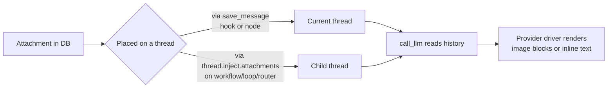

Every file a workflow touches — an uploaded screenshot, a referenced PDF, a local source file — is an **attachment**: a database row carrying a filename, a MIME type, and bytes. Workflows never reach into the filesystem directly. They interact with files through one of three surfaces described below: declared inputs, saved thread messages, or inject attachments on a spawned child thread.

One thing that surprises people: there is **no `attachments` field on `call_llm`**. The `CallLLM` activity loads the current thread's message history and hands it to the provider driver — attachments reach the model only because they're already on a message the thread contains. If you need a file in front of the LLM, your job is to get it onto the right thread before `call_llm` runs.

## How attachments reach an LLM call

There are two paths, and both work by placing an attachment onto a thread message that `call_llm` will later read:



1. **Save it into the current thread** on a prior node, using either the `save_message` hook available on every node or a standalone `save_message` node.
2. **Inject it into a fresh child thread** via `thread.inject.attachments` on a structural `workflow`, `loop`, or `router` node.

Once an attachment is on a message in the thread, the provider driver does the rest. Image types (jpg, png, gif, webp) are rendered as image content blocks for vision-capable models; text and source files are inlined as text content. Unsupported types are rejected at save time.

There is no workflow-level mechanism to attach a file to a single `call_llm` invocation in isolation — ad-hoc one-shot attachments aren't currently expressible in the workflow model.

## Workflow inputs: `type: attachments`

Workflows can declare an attachments input just like any other typed input:

```yaml
name: image-annotator
inputs:
  message:
    type: message
  screenshots:
    type: attachments
    description: Screenshots to annotate
    min_items: 1
    max_items: 10

nodes:
  - id: describe
    type: call_llm
    args:
      model:
        tags: [flagship]
    save_message:
      role: user
      content: "{{inputs.message.text}}"
      attachments: "{{inputs.screenshots}}"
```

The caller must pass an array of attachment IDs for the `screenshots` key. The value is referenced in CEL as `inputs.screenshots` and must resolve to a `[]string` of attachment IDs.

<Warning>
**The chat UI does not auto-populate `inputs.attachments` from the message composer.** When a user drags a file into chat, the frontend attaches it to the user **message** (stored directly on the message row), not to `workflow_params`. That means the attachment ends up on the thread's first user message and is visible to `call_llm` through thread history — but `inputs.attachments` will be empty unless the caller explicitly plumbs attachment IDs through `workflow_params`. If your workflow needs `inputs.attachments` specifically (for example, to forward them to a sub-workflow), the calling surface has to set it.
</Warning>

The `min_items` / `max_items` bounds are enforced by [`validation/inputs.go`](/reference/workflow-schema) — the workflow fails to start if the caller passes too few or too many attachment IDs.

## Saving attachments on a message

### The `save_message` hook

Every node supports a `save_message` hook that runs after the node completes. Its `attachments` field is a CEL expression — it must evaluate to a `[]string` of attachment IDs.

```yaml
- id: echo_user_message
  type: call_llm
  args:
    model:
      tags: [fast]
  save_message:
    role: user
    content: "{{inputs.message.text}}"
    attachments: "{{has(inputs.attachments) ? inputs.attachments : null}}"
```

The ternary guard is the canonical pattern. When `inputs.attachments` isn't present, the expression returns `null`, which `evaluateSaveMessageConfig` treats as "no attachments". Without the guard, referencing a missing key raises a CEL error.

<Warning>
The CEL expression **must return a list of strings**. A bare string like `"{{inputs.my_file_id}}"` resolves to a scalar, which the evaluator coerces using `fmt.Sprintf` — you'll end up with a single-element list whose element is the literal text `"<attachment_id>"`, which almost never matches a real row. Wrap single IDs in a list: `"{{[inputs.my_file_id]}}"`.
</Warning>

A few common shapes:

```yaml
# Forward all attachments the caller passed
attachments: "{{has(inputs.attachments) ? inputs.attachments : null}}"

# Forward a single ID (wrap in a list!)
attachments: "{{[inputs.cover_image]}}"

# Filter to a subset
attachments: "{{inputs.files.filter(f, f.endsWith('.png'))}}"

# Empty array — valid, saves a message with no attachments
attachments: "{{[]}}"
```

### The standalone `save_message` node

The [`save_message` node](/reference/nodes#save-message) takes the same fields as the hook but runs as its own graph step. Use it when you want the save to be a first-class node you can reference from other nodes (`nodes.save_files.message_id`), gate with a condition, or place at a point in the graph that doesn't correspond to another node's post-execution.

```yaml
- id: stash_inputs
  type: save_message
  args:
    role: user
    content: "{{inputs.message.text}}"
    attachments: "{{has(inputs.attachments) ? inputs.attachments : null}}"
```

The semantics are identical — both paths resolve the CEL expression, load the referenced attachment rows, and attach them to the message. The hook is slightly terser; the standalone node is clearer when the save is the logical step.

## Injecting files into a child thread

Structural parents — `type: workflow`, `type: loop`, and `type: router` — can configure a `thread.inject` block that seeds the child thread with an initial message. That inject message can carry attachments from three sources.

<Note>
`inject.attachments` is only available on the thread-capable node types. It lives on `SubWorkflowArgs` / `LoopArgs` / `RouterArgs`, not on the common node base. Leaf nodes like `call_llm` don't have a `thread` field of their own.
</Note>

### The three sources

Each entry in `thread.inject.attachments` is an `InjectAttachment` with exactly one of `id`, `path`, or `data` set, plus optional `filename` and `mime_type` overrides.

#### `id` — reference an existing attachment

This is the most common shape: forward an attachment that's already in the database into a child thread.

```yaml
- id: analyst
  type: workflow
  ref: builtin://agent
  thread:
    mode: new
    inject:
      role: user
      content: |
        Analyze the attached screenshot and report what you see.
      attachments:
        - id: att_01HXYZ
```

The attachment must already exist in the database. No bytes are read, no file I/O happens — only an association.

<Warning>
**Per-item `InjectAttachment` fields are plain strings, not CEL expressions.** You cannot write `- id: "{{inputs.file_id}}"` and have it interpolate at runtime. The field is a literal proto `string`, so CEL evaluation never runs over it. If you need dynamic attachment IDs forwarded into a child thread, see [Forwarding dynamic attachments to a child](#forwarding-dynamic-attachments-to-a-child) below.
</Warning>

#### `path` — read a file from disk at runtime

The daemon reads bytes from the local filesystem and creates a fresh attachment row for the child thread.

```yaml
- id: analyst
  type: workflow
  ref: builtin://agent
  thread:
    mode: new
    inject:
      role: user
      content: Review the attached spec.
      attachments:
        - path: docs/specs/feature-x.md
        - path: /tmp/screenshot.png
          filename: reference-ui.png
          mime_type: image/png
```

`filename` defaults to `filepath.Base(path)` and `mime_type` is detected from the extension. Both can be overridden per entry.

<Warning>
**`path` is daemon-local, and missing files are silently skipped.** Reliant's daemon is the only component with filesystem access in distributed mode; the API server, worker, and daemon gateway cannot read disk. The path is resolved relative to the daemon's current working directory at execution time (typically the project/worktree path). If the file doesn't exist or can't be read, `resolveInjectAttachments` logs a warning and drops that entry — **the node does not fail**. Treat missing paths as a quiet no-op you have to notice in logs.
</Warning>

<Warning>
Each evaluation of `inject.attachments` creates a **new attachment row per iteration**. In loops, this means the same `path:` source is read from disk and persisted separately for every iteration, which has memory and I/O implications for large files. See [Parallel loops and attachments](#parallel-loops-and-attachments) below.
</Warning>

#### `data` — raw bytes

`data` is the programmatic escape hatch: raw `bytes` embedded in the workflow or injected by code that builds the proto directly. In hand-written YAML you'll almost never use it, but it exists for callers that already have the content in memory.

```yaml
attachments:
  - data: <base64 bytes>
    filename: report.pdf
    mime_type: application/pdf
```

`filename` is effectively required — without it there's no MIME hint and no sensible display name. If `mime_type` is omitted it's detected from `filename`'s extension.

### Forwarding dynamic attachments to a child

Because per-item `InjectAttachment` fields aren't CEL-evaluated, you can't write something like this and expect it to work:

```yaml
# ❌ This does NOT interpolate. The child sees no attachments.
thread:
  mode: new
  inject:
    content: "Look at these files"
    attachments:
      - id: "{{inputs.file_ids[0]}}"
```

There are two recommended patterns for "forward whatever the user sent into a sub-agent":

**Option 1: Save onto the parent thread, use `mode: inherit` (or `fork`) on the child.** The child sees the parent's thread history, including the message that carries the attachments.

```yaml
nodes:
  - id: stash
    type: save_message
    args:
      role: user
      content: "{{inputs.message.text}}"
      attachments: "{{has(inputs.attachments) ? inputs.attachments : null}}"

  - id: analyst
    type: workflow
    ref: builtin://agent
    thread:
      mode: inherit   # or: fork
```

This is the right answer most of the time. The attachments live on a real thread message; the child inherits (or forks) the thread and reads them the same way any other participant would.

**Option 2: Save them onto the spawning node's hook and use a fresh child thread.** If you want the child to start clean but still see the attachments, save on the parent hook and then fork:

```yaml
- id: analyst
  type: workflow
  ref: builtin://agent
  save_message:
    role: user
    content: "{{inputs.message.text}}"
    attachments: "{{has(inputs.attachments) ? inputs.attachments : null}}"
  thread:
    mode: fork
    inject:
      role: user
      content: You are the analyst. Review what's above.
```

The save hook runs on the parent thread before the child is spawned, then `mode: fork` copies the parent's messages (including your saved attachments) into the new child thread.

The one pattern that simply doesn't work is per-item dynamic `inject.attachments: [{ id: "{{...}}" }]`. If you find yourself reaching for it, restructure around `save_message` instead.

## Supported file types

Reliant's attachment type registry lives in `internal/attachment/filetypes.go` and divides files into three buckets: images (sent as image content blocks), text/file references (inlined as text), and unsupported (rejected).

**Images** are binary files the provider driver renders as image content blocks on vision-capable models:

```
.jpg  .jpeg  .png  .gif  .webp
```

**Text and file references** are read and inlined as text content. The list is broad, covering:

- **Docs and data**: `.md`, `.markdown`, `.mdx`, `.txt`, `.rst`, `.json`, `.yaml`, `.yml`, `.toml`, `.xml`, `.csv`, `.tsv`, `.ini`, `.conf`, `.cfg`, `.env`, `.properties`, `.log`, `.diff`, `.patch`, `.proto`
- **Documents**: `.pdf`, `.docx`
- **Source code**: `.go`, `.py`, `.js`, `.jsx`, `.ts`, `.tsx`, `.rs`, `.java`, `.kt`, `.scala`, `.c`, `.cpp`, `.h`, `.hpp`, `.cs`, `.swift`, `.rb`, `.php`, `.lua`, `.r`, `.dart`, `.ex`, `.erl`, `.clj`, `.hs`, `.ml`, `.zig`, `.jl`, and many others
- **Shell and build**: `.sh`, `.bash`, `.zsh`, `.ps1`, `.dockerfile`, `.makefile`, `.cmake`, `.gradle`, `.tf`, `.hcl`, `.sql`, `.graphql`
- **Web**: `.html`, `.css`, `.scss`, `.vue`, `.svelte`, `.astro`

There's also a list of **special filenames** that are treated as text regardless of extension: `Dockerfile`, `Makefile`, `Gemfile`, `Rakefile`, `LICENSE`, `README`, `CHANGELOG`, `.gitignore`, `.editorconfig`, and similar. Call `attachment.SupportedExtensions()` or read `internal/attachment/filetypes.go` for the exhaustive list.

Anything outside these lists is classified as `TypeUnsupported` and will be rejected at save time with an `invalid attachment type` error. If you need an extension added, that's a change to `filetypes.go`, not to any workflow config.

## Parallel loops and attachments

Every loop iteration calls `resolveInjectAttachments` independently. That matters for the three sources in different ways:

- **`id`** — cheap. The same attachment ID is reused across iterations; no new DB rows are created.
- **`path`** — the file is **re-read from disk on every iteration** and a fresh attachment row is persisted each time. For a parallel loop with N iterations, that's N file reads and N new attachment rows, even if the file hasn't changed.
- **`data`** — the raw bytes are **duplicated across N child threads**, one attachment row per iteration.

None of this is a correctness issue, but it's worth knowing before you put a large file behind `path:` or `data:` in a wide parallel loop. If a file is large or shared across iterations, persist it as a DB attachment once and reference it by `id:` instead.

## Memoized threads and attachments

Setting `thread.memo: true` tells the runtime to create the child thread exactly once and reuse it across loop iterations. The inject (content, attachments, everything) is applied only on the first iteration — subsequent iterations see the thread that already exists.

```yaml
- id: evaluator
  type: loop
  thread:
    mode: new
    memo: true
    inject:
      role: user
      content: You are evaluating candidates. Here are the reference files.
      attachments:
        - id: att_reference_spec
```

This is the right shape for "seed the agent once, then have it accumulate context as the loop runs." It's the wrong shape if you expected each iteration to see a different attachment — with `memo: true`, the attachments on iteration 2+ are whatever's already on the memoized thread.

See [Threads → Memo behavior](/features/threads#memo-behavior) for the full discussion of `memo` and `inject` frequency.

## Size and payload limits

There is no explicit workflow-level cap on `path` or `data` injects. However, the `SaveMessage` activity serializes `InjectFileMsg` (filename, MIME type, raw bytes) as a Temporal activity payload, and Temporal's default payload limit is **2 MiB**. A large file pushed through `path:` or `data:` can silently fail that activity when the encoded payload exceeds the limit — the workflow will surface a Temporal error rather than a nice validation message.

<Tip>
For anything meaningfully large, upload the file once (outside the workflow) to create a DB attachment row, then reference it by `id:`. `id`-based inject passes a UUID through activities, not bytes, so the payload stays small regardless of file size.
</Tip>

## Related

- [Threads](/features/threads) — thread modes, inject context, and memoization
- [Node types reference](/reference/nodes) — [Save Message](/reference/nodes#save-message), [Loop](/reference/nodes#loop), [Agent / sub-workflow](/reference/nodes#agent), [Router](/reference/nodes#router)
- [Types reference](/reference/types) — [InjectConfig](/reference/types#injectconfig), [SaveMessageConfig](/reference/types#savemessageconfig), [ThreadConfig](/reference/types#threadconfig)
- [CEL Expressions Reference](/reference/cel-expressions) — working with `inputs.*` and `nodes.*` in save_message expressions