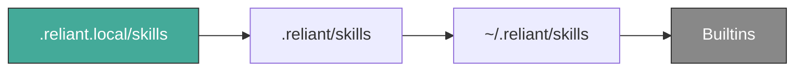

Skills are reusable sets of instructions that customize how Reliant's agents behave for specific tasks. Think of them as saved expertise — a skill for "frontend design" or "incident response" gives agents the right context, examples, and rules without you repeating yourself every time. Skills use the shared **Agent Skills** format (`SKILL.md`), so they're portable across tools that support the standard.

## Quick start

Create a skill by adding a `SKILL.md` file in a skill directory:

```text
.reliant/skills/my-skill/SKILL.md
```

A minimal `SKILL.md` looks like this:

```markdown
---
name: my-skill
description: A short description of what this skill does
---

Your skill instructions go here as markdown.
Agents will follow these instructions when the skill is active.
```

That's it — Reliant discovers and loads it automatically.

## How discovery works

Reliant looks for skills in four locations, checked in order. When two skills share the same name, the first one found wins:



| Scope | Path | Use case |
|---|---|---|
| Project local | `.reliant.local/skills/` | Personal overrides (gitignored) |
| Project | `.reliant/skills/` | Shared team skills (committed) |
| Global | `~/.reliant/skills/` | Your skills across all projects |
| Builtins | Embedded in Reliant | Default skills |

Only Reliant-managed roots are scanned at runtime. If you have skills in other tool folders (`.claude/skills`, `.codex/skills`, etc.), import them into a Reliant root first — see [Migration](#migrating-skills-from-other-tools) below.

## SKILL.md format

### Required fields

- **`name`** — 1–64 characters, lowercase letters, digits, and hyphens. No leading/trailing hyphens, no consecutive hyphens. Must match the parent directory name.
- **`description`** — 1–1024 characters.

### Optional fields

- **`license`** — License identifier.
- **`compatibility`** — 1–500 characters describing compatibility notes.
- **`metadata`** — A string-to-string map for custom key-value pairs.
- **`allowed-tools`** — Space-delimited tool list (e.g. `Bash(git:*) Read`). When set, Reliant restricts tools to this list for the skill's turn and warns about blocked tools.

Unknown frontmatter fields are rejected.

## Supporting files

Non-definition files in the skill directory are treated as supporting material and can be provided to agents when the skill is active:

- `examples/*.md`
- `templates/*.txt`
- `reference.md`

**What gets excluded:**

- The `SKILL.md` definition itself
- Legal/meta files (LICENSE, etc.)
- OpenAI-specific metadata paths (`agents/**`)
- Image assets under `assets/**`
- Symlinks
- Unreadable files (skipped with diagnostics)

Content is bounded and truncated to stay within prompt limits.

### Configuring limits

Control how much supporting-file content gets loaded via any config scope (`~/.reliant/config.yaml`, `.reliant/config.yaml`, or `.reliant.local/config.yaml`):

```yaml
skills:
  supportingFiles:
    maxFiles: 8      # max files read from disk per skill
    maxBytes: 4096   # max bytes per file
  retrieval:
    maxFiles: 8      # max files considered by retrieval ranking
    maxChunks: 12    # max ranked chunks retained
    chunkBytes: 1200 # chunk size for segmenting content
    chunkOverlap: 200 # overlap between chunks
    maxPromptBytes: 12000 # final prompt budget for supporting content
```

Safe defaults are applied if values are unset or invalid.

## How skills are loaded into prompts

Reliant keeps prompt usage efficient by loading skill content progressively:

- A compact `<available_skills>` block is always injected so agents know what's available.
- Discovery reads only metadata at startup — full content is deferred.
- Full instructions are injected only for the **active** skill.
- Supporting-file content goes through chunking, relevance ranking, and prompt-budget caps.
- Warnings surface as `<skills_notice>` entries in the prompt and as chat notices.

## Invocation

### Activation mode

Control how skills get activated via `skills.activationMode`:

```yaml
skills:
  activationMode: auto   # auto | explicit
```

- **`auto`** (default) — Reliant picks the most relevant skill based on message context.
- **`explicit`** — Skills only activate when you invoke one directly.

### Explicit invocation

You can always invoke a skill directly in chat:

- `/skill-name` — exact match
- `/skill skill-name` — unique prefix resolution

If the invocation is missing or ambiguous, Reliant shows a notice in chat.

### Integration mode

Control how supporting files are surfaced via `skills.integrationMode`:

```yaml
skills:
  integrationMode: filesystem   # filesystem | tool
```

- **`filesystem`** (default) — Include filesystem location hints and load supporting files into prompt context.
- **`tool`** — Suppress filesystem hints and avoid injecting supporting-file content.

## Skill installer

Reliant includes an `install_skill` tool for installing skills into managed destinations.

> **Feature gate:** The skills feature (runtime activation, settings APIs, and `install_skill`) requires `features.skills_enabled=true`.

### Sources

- Local directory containing `SKILL.md`
- Git URL with optional `source_subpath`
- GitHub `tree` and `blob` URLs

### Destination scopes

- `project` → `.reliant/skills/`
- `project_local` → `.reliant.local/skills/`
- `global` → `~/.reliant/skills/`

### Conflict policies

- **`skip`** (default) — Keep existing files, skip conflicts.
- **`overwrite`** — Replace existing files.
- **`rename`** — Install into a suffixed directory. Not supported for `SKILL.md` skills because the skill name must match the parent directory name.

### Examples

**Dry-run preview:**

```json
{
  "source": "/path/to/skill-dir",
  "scope": "project",
  "conflict_policy": "skip",
  "dry_run": true
}
```

**Apply install:**

```json
{
  "source": "/path/to/skill-dir",
  "scope": "project_local",
  "conflict_policy": "overwrite"
}
```

**Install from git with subfolder:**

```json
{
  "source": "https://github.com/acme/skills.git",
  "source_subpath": "skills/incident-response",
  "ref": "main",
  "scope": "project",
  "conflict_policy": "rename",
  "dry_run": true
}
```

**Install from a GitHub tree URL:**

```json
{
  "source": "https://github.com/anthropics/skills/tree/main/skills/frontend-design",
  "scope": "project",
  "conflict_policy": "rename",
  "dry_run": true
}
```

### Safety guarantees

- Validates `scope` and `conflict_policy` values strictly
- Rejects symlinks in source and destination
- Rejects path traversal (including in `source_subpath`)
- Uses staging + rollback to avoid partial installs on failure
- Runs post-install discovery validation
- Skips excluded non-runtime files

## Frontend skills management

The **Settings → Skills** page provides a UI for managing skills:

- View discovered skills across all scopes with format and location details
- Install from recommended skills or import from other tool folders (`.claude/skills`, `.codex/skills`, `.agents/skills`, `.cursor/skills`)
- Run the installer in dry-run or install mode directly from the UI
- Copy installer prompts for chat-based execution
- Copy skill definitions and starter prompts for the built-in skill creator

Both direct UI execution and assistant-assisted chat execution use the same backend installer and guardrails.

## Migrating skills from other tools

If you have skills in `.claude/skills`, `.codex/skills`, `.agents/skills`, or similar folders:

1. Put shared/team skills in `.reliant/skills/`
2. Put personal variants in `.reliant.local/skills/`
3. Use **Settings → Skills** import actions or the `install_skill` tool to copy them into Reliant roots

## Compatibility

Reliant supports the shared Agent Skills format used by Claude and Codex, including `SKILL.md` with YAML frontmatter, supporting files, and multi-scope discovery.

**What Reliant does not support:**

- Plugin ecosystems or plugin execution contracts from other tools
- Runtime side effects that bypass Reliant's tool governance
- External installer behaviors that conflict with Reliant's installation model

These boundaries exist to keep behavior predictable and the tool set secure. For Codex-specific ecosystem features (installer conventions, tool-specific metadata files), Reliant ingests what's portable, ignores what's tool-specific, and uses its own controls for policy, limits, and governance.

## Related topics

- [MCP Servers](/settings/mcp-servers)
- [Custom Workflows](/workflows/custom-workflows)
- [Presets](/workflows/presets)
