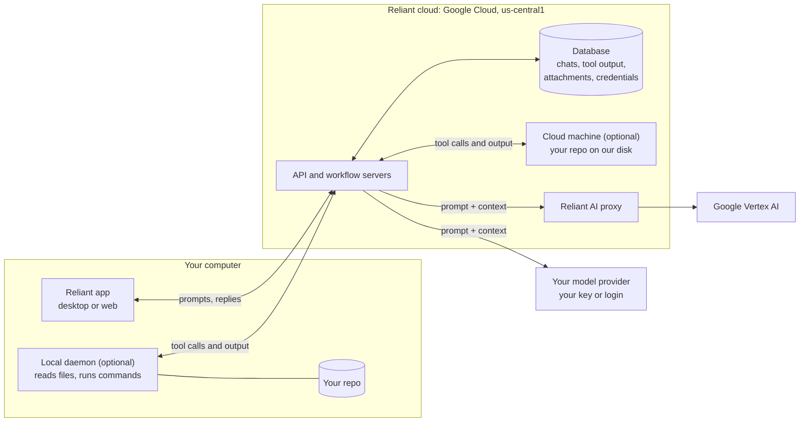

Reliant is a cloud service, and you need an account to use it. The desktop and web apps talk to Reliant's API and workflow servers in Google Cloud (us-central1), and those servers run the agent loop. They call the AI model. When the model wants to read a file or run a command, they send that tool call to a **daemon**: one running on your own machine, on any machine you own, or on a cloud machine we host for you. The daemon returns the result. Our servers store it in your chat and send it to the model as context. Model calls are always made from our servers, never from your device, whether you use your own API key, a provider login, or Reliant AI.

So your repository stays wherever the daemon runs. But **anything the agent reads, and anything a command prints, is sent to our servers, stored with your chat, and sent to your model provider.**

## How data flows



A local daemon connects outbound to our gateway; it doesn't open any inbound ports on your machine. It only reads files and runs commands when the agent asks it to.

## What goes where

| Data | Stays on your machine? | Stored by Reliant? | Sent to the model provider? |
| --- | --- | --- | --- |
| Files in your repo the agent never opens | Yes, with a local daemon | Only on a cloud machine, where the whole repo lives on its disk | No |
| Files the agent reads, search results, diffs, command output | A copy stays on your machine | **Yes**, as tool output in your chat | **Yes** |
| Your prompts and the model's replies | No | Yes | Yes |
| Attachments you upload | No | Yes | Yes, when included in the conversation |
| Memories (`reliant.md`), workflows and presets | Yes, as files where the daemon runs | Yes, copies with your project settings | Yes. Memories and workflow prompts are part of what the model sees |
| Project details: paths, repo URLs, branch names | Yes | Yes | Often, because they appear in prompts and tool output |
| Model API keys and provider logins | No | Yes, encrypted at the application layer | Only to authenticate with that provider |
| Integration credentials (GitHub, Gmail, Slack, Twilio) | No | Yes, encrypted at the application layer | No. The results of integration actions are sent, like any other tool output |
| Secrets in your files or command output | Yes | **Yes, if the agent reads or prints them** | **Yes, if the agent reads or prints them** |
| Analytics and crash reports | No | Sent to Statsig and Sentry (on by default; see [Telemetry](#telemetry)) | No |

<Warning>
Secrets get no special handling. If the agent opens a `.env` file, prints an environment variable, or runs a command that echoes a token, that text becomes tool output. It is stored with your chat and sent to your model provider. Keep secrets out of the agent's reach, use approval modes for commands you haven't reviewed, and store deployment secrets with [Secrets](/features/secrets). If a key has been exposed, rotate it.
</Warning>

### Local daemon vs. cloud machine

| | Local daemon | Cloud machine |
| --- | --- | --- |
| Where your code lives | Your disk | A persistent disk in Google Cloud (us-central1), inside its own lightweight VM (Kata Containers) |
| What reaches our servers | Whatever the agent reads or a command prints | The same, plus the entire contents of the machine's disk |
| Where commands run | Your machine | Our infrastructure |
| When it's deleted | Whenever you choose | When you delete the machine |

See [Remote Daemons](/features/remote-daemons) for how to run a daemon on your own machines.

### Local models

You can point Reliant at a model server running on your own hardware (Ollama, LM Studio, or any OpenAI-compatible endpoint) in `~/.reliant/config.yaml`; see [Model Configuration](/settings/model-config). Because model calls are made by our servers, the request is relayed through your daemon to the local server. That means the prompt and the reply still pass through our servers and are stored in your chat like any other. A local model keeps the *inference* on your hardware, not the conversation. It needs a daemon on the machine that can reach the model server.

### Other services the agent can reach

- **Integrations** you connect (GitHub, Gmail, Slack, Twilio, custom HTTP): what the agent sends goes to that service under your account.
- **MCP servers** you configure get the tool calls the agent makes to them.

## Your model provider and training

### No training

We don't use your content to train or fine-tune AI models. That includes your prompts, code, files, tool outputs, chats, attachments, and anything from services you connect. This applies to every user on every plan.

### Your own API key or provider login

If you add your own API key, or sign in with a provider subscription (Claude, Codex, GitHub Copilot and others), our servers call that provider on your behalf, **under your account**. The provider's terms and privacy policy apply to what it receives, including whether it keeps the data or trains on it. API plans and consumer subscriptions are often treated differently, so check your provider's settings:

- [Anthropic privacy policy](https://www.anthropic.com/legal/privacy)
- [OpenAI privacy policy](https://openai.com/policies/privacy-policy)
- [Google AI terms](https://ai.google.dev/terms)

### Reliant AI

If you use the optional Reliant AI provider, requests go through our own proxy (LiteLLM) to **Google Vertex AI**. Vertex AI may cache inputs and outputs in memory for up to 24 hours to speed up repeated requests, and this caching is currently on. Google doesn't use this data to train its models. We use Vertex AI's global endpoint, so a request can be processed in any Google region, not only the US.

Whichever provider you use, the conversation is also stored in your chat history on our servers.

## Telemetry

Both kinds of telemetry are **on by default**. To turn them off, go to **Settings → Privacy**.

| Toggle | Sent to | What's included |
| --- | --- | --- |
| **Analytics and Usage Data** | Statsig | Product-usage events, tied to a device ID and your account ID. |
| **Crash and Error Reporting** | Sentry | Crash and error reports: the error type, stack trace, app version and identifiers such as chat and run IDs. Request bodies, console output and custom data are removed, and error messages are cut to one short line with known credential formats redacted. That short line can still contain a fragment of text. Web session replays mask all on-screen text and form inputs, and block images, media and canvas. |

Crash reports contain error details and stack traces; we don't upload memory dumps.

Our server logs record identifiers, counts, durations and status codes, not the content of your prompts, chats, tool inputs or outputs, or files. File paths can appear in error logs for file operations. Server logs are kept for 30 days.

## Deleting your data

### Chats

Deleting a chat **archives** it. Deleting the archived chat **permanently deletes** it, along with its messages, tool outputs and attachments.

### Cloud machines

Delete the machine to delete its disk and everything on it.

### Your account

You can delete your account in the app's account settings, or email support@reliantlabs.io. Deletion is blocked while a paid subscription is active, so cancel your subscription first. A wallet balance doesn't block deletion: when you delete your account, we refund the remaining paid balance to your original payment method, and promotional credit, such as credit from coupons, is forfeited. The confirmation screen shows both amounts before you confirm. If a refund can't go back to your card automatically, our support team refunds it for you.

### How long we keep things

| Data | Retention |
| --- | --- |
| Chats, messages, tool outputs, attachments | Until you delete them |
| Workflow run history | 7 days after the run ends |
| Large stored workflow payloads | 30 days |
| Database backups | Nightly; the 7 most recent are kept. Manual backups taken before maintenance are kept separately |
| Server logs | 30 days |

The [Privacy Policy](https://reliantlabs.io/privacy) has the complete list.

### Clearing local app data

These commands remove Reliant's files from your computer: your local config, the desktop app's data and sign-in state, and daemon credentials. They **don't** delete anything on our servers; delete your chats and account for that. Your project files (`reliant.md`, `.reliant/` in your repos) aren't touched.

<Warning>
`~/.reliant/` also contains the git worktrees Reliant creates (`~/.reliant/worktrees/`). Commit or push any work in them before deleting it.
</Warning>

```bash
# Local config, including worktrees (all platforms)
rm -rf ~/.reliant/

# macOS: desktop app data, daemon credentials, logs
rm -rf ~/Library/Application\ Support/reliant
rm -rf ~/Library/Logs/Reliant

# Linux
rm -rf ~/.config/reliant
```

```powershell
# Windows
Remove-Item -Recurse -Force "$env:APPDATA\reliant"
```

## Security practices

**Code modifications.** In manual approval mode, Reliant shows each edit before applying it and waits for your confirmation. In auto modes, edits are applied directly and shown in the conversation as they happen.

**Tool execution.** Shell commands and file operations are logged in the conversation, visible in the UI before execution, and controllable via approval modes.

## More detail

- [Privacy Policy](https://reliantlabs.io/privacy): the full legal version, including your rights under GDPR and CCPA
- **Need a DPA?** Email support@reliantlabs.io.
- **Security issues:** email [security@reliantlabs.io](mailto:security@reliantlabs.io).
