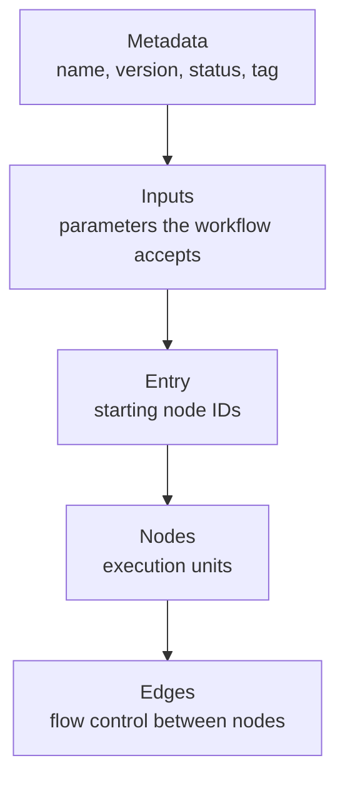

Reliant workflows let you automate complex multi-step tasks, enforce development processes, and coordinate multiple agents. There are three ways to create workflows, from fully visual to fully manual.


## When to Create Custom Workflows

Before building a custom workflow, consider whether you actually need one. Workflows shine in specific scenarios:

**Automate repetitive multi-step tasks**: If you find yourself repeatedly running the same sequence of agent interactions—like "analyze code, write tests, run tests, fix failures"—a workflow captures that pattern and makes it repeatable.

**Enforce specific processes**: Workflows can encode your team's practices. A TDD workflow that requires tests to fail before allowing implementation. A code review workflow that requires two agents to approve changes. A security audit that runs after every feature implementation.

**Create specialized agents**: Sometimes you need an agent with specific tools, prompts, or behaviors. A workflow can define a "documentation writer" or "security auditor" persona with appropriate constraints.

**Build multi-agent coordination**: When you need multiple agents working together—whether in debate, parallel competition, or sequential handoff—workflows provide the orchestration.

If you just need to run a single agent with a specific prompt, consider using [Presets](/workflows/presets) instead. Workflows are for when you need control flow, loops, or multiple agents.

## Three Ways to Create Workflows

Reliant provides three methods for creating custom workflows, each suited to different situations.

### YAML (Manual)

Write workflow definitions directly in YAML files placed in `.reliant/workflows/`. This gives you full control over every aspect of the workflow—nodes, edges, conditions, loops, thread configuration, and inputs. Most of this guide covers YAML authoring in detail.

Best for: Fine-tuning workflows, understanding exactly what's happening, version-controlled workflow definitions.

### Visual Editor

The visual editor provides a graphical interface for building workflows. You can drag and drop nodes, draw edges between them, and configure node properties through forms. The visual editor reads and writes the same YAML format, so you can switch between the visual editor and hand-editing YAML at any time.

Best for: Exploring workflow structure visually, quickly prototyping node graphs, understanding how edges route execution.

### AI Builder Assistant

The AI builder assistant creates workflows through conversation. Describe what you want the workflow to do, and the assistant generates the workflow definition for you. It can analyze your codebase to suggest appropriate tools, prompts, and patterns.

The AI builder always creates [scenario tests](/workflows/testing#scenario-testing) and runs [static validation](/workflows/testing#static-validation) for every workflow it produces. This means workflows created by the AI builder come with built-in test coverage from the start.

Best for: Getting started quickly, creating workflows for unfamiliar patterns, ensuring test coverage from day one.

<Tip>
All three methods produce the same YAML format. A workflow created with the AI builder can be edited in the visual editor or by hand, and vice versa.
</Tip>

## Workflow File Location

Reliant automatically discovers workflow files in your project's `.reliant/workflows/` directory.

<Tree>
  <Tree.Folder name="your-project" defaultOpen>
    <Tree.Folder name=".reliant" defaultOpen>
      <Tree.Folder name="workflows" defaultOpen>
        <Tree.File name="code-review.yaml" />
        <Tree.File name="security-audit.yaml" />
        <Tree.File name="release-prep.yaml" />
      </Tree.Folder>
    </Tree.Folder>
    <Tree.Folder name="src" />
  </Tree.Folder>
</Tree>

**Naming convention**: Use lowercase with hyphens (for example, `code-review.yaml`). The filename becomes the workflow identifier.

**Discovery**: When you start Reliant, it scans for `.yaml` files in `.reliant/workflows/`. Changes require restarting Reliant or reloading workflows.

Commit your `.reliant/workflows/` directory to version control to share workflows with your team.

## Anatomy of a Workflow



A workflow file has five key sections. Here's the minimal structure:

```yaml
# 1. Metadata - identifies the workflow
name: my-workflow
version: v0.0.1
description: A simple custom workflow
status: published
tag: agent

# 2. Inputs - parameters the workflow accepts
inputs:
  model:
    type: model
    default: ""
    description: LLM model to use

# 3. Entry point - where execution starts
entry: [main_step]

# 4. Nodes - the execution units
nodes:
  - id: main_step
    workflow: builtin://agent
    args:
      model: "{{inputs.model}}"

# 5. Edges - flow control (optional for single-node workflows)
# edges: []
```

The following sections explain each part.

### Metadata

The top of your workflow file contains identification metadata:

| Field | Required | Description |
| --- | --- | --- |
| `name` | Yes | Unique identifier for the workflow |
| `version` | No | Semantic version (for example, `v0.0.1`) |
| `description` | No | Human-readable description shown in UI |
| `status` | No | Visibility: `draft`, `published`, or `internal` |
| `tag` | No | Category for preset matching (typically `agent`) |

Use `status: draft` while developing—draft workflows don't appear in the workflow picker but can still be tested directly.

### Inputs

Inputs define what parameters your workflow accepts. Every input needs either a default value or `required: true`:

```yaml
inputs:
  model:
    type: model
    default: ""
    description: LLM model to use

  temperature:
    type: number
    default: 1.0
    min: 0
    max: 2
    description: Response randomness

  mode:
    type: enum
    enum: ["manual", "auto"]
    default: "auto"
    description: Execution mode

  review_areas:
    type: string
    required: true
    description: What aspects to review
```

Common input types: `string`, `number`, `integer`, `boolean`, `enum`, `model`, `tools`, `preset`.

For complete input type documentation, see the [Types Reference](/reference/types).

### Entry Point

The `entry` field specifies which node starts execution:

```yaml
entry: [main_step]
```

For parallel starts, use an array:

```yaml
entry: [agent_1, agent_2, agent_3]
```

### Nodes

Nodes are the execution units. Each node has an `id` and a type that determines what it does:

**Workflow nodes** run a child workflow, either by reference or inline:

```yaml
# Reference an external workflow
- id: run_agent
  workflow: builtin://agent
  args:
    model: "{{inputs.model}}"

# Or define the sub-workflow inline
- id: planning
  type: workflow
  inline:
    entry: [plan]
    nodes:
      - id: plan
        type: workflow
        ref: builtin://agent
    outputs:
      summary: "{{nodes.plan.response_text}}"
```

**Action nodes** execute built-in activities:

```yaml
- id: save_result
  action: SaveMessage
  args:
    role: assistant
    content: "Analysis complete!"
```

**Run nodes** execute shell commands:

```yaml
- id: run_tests
  run: npm test
```

**Loop nodes** repeat a sub-workflow while a condition is true:

```yaml
- id: retry_loop
  loop:
    while: outputs.exit_code != 0 && iter.iteration < 5
    inline:
      # ... inline workflow definition
```

### Edges

Edges define how execution flows between nodes. They're only required when you have multiple nodes or need conditional routing:

```yaml
edges:
  - from: step_one
    default: step_two
```

For conditional routing:

```yaml
edges:
  - from: run_tests
    cases:
      - to: success_handler
        condition: nodes.run_tests.exit_code == 0
        label: passed
      - to: failure_handler
        condition: nodes.run_tests.exit_code != 0
        label: failed
```

## Building Your First Custom Workflow

This section walks through building a code review workflow that analyzes code and provides structured feedback.

### Step 1: Create the File

Create `.reliant/workflows/code-review.yaml`:

```yaml
name: code-review
version: v0.0.1
description: Analyzes code and provides structured review feedback
status: draft
tag: agent

entry: [review]
```

### Step 2: Define Inputs

Think about what the user should be able to configure:

```yaml
inputs:
  model:
    type: model
    default: ""
    description: LLM model to use

  focus_areas:
    type: string
    default: "code quality, potential bugs, security concerns, performance"
    description: What aspects of the code to review
```

### Step 3: Add the Review Node

The simplest approach uses the built-in agent workflow with a custom system prompt:

```yaml
nodes:
  - id: review
    workflow: builtin://agent
    thread:
      mode: inherit
    args:
      model: "{{inputs.model}}"
      mode: auto
      system_prompt: |
        You are a senior code reviewer. Analyze the code thoroughly and provide
        actionable feedback.

        Focus on: {{inputs.focus_areas}}

        Structure your review as:
        1. **Summary**: Brief overview of what the code does
        2. **Strengths**: What's done well
        3. **Issues**: Problems found (with severity: Critical/Major/Minor)
        4. **Suggestions**: Recommended improvements

        Be specific. Reference exact line numbers and code snippets.
        Explain *why* something is an issue, not just *what* is wrong.
```

### Step 4: The Complete Workflow

Here's the full workflow file:

```yaml
name: code-review
version: v0.0.1
description: Analyzes code and provides structured review feedback
status: published
tag: agent

entry: [review]

inputs:
  model:
    type: model
    default: ""
    description: LLM model to use

  focus_areas:
    type: string
    default: "code quality, potential bugs, security concerns, performance"
    description: What aspects of the code to review

nodes:
  - id: review
    workflow: builtin://agent
    thread:
      mode: inherit
    args:
      model: "{{inputs.model}}"
      mode: auto
      system_prompt: |
        You are a senior code reviewer. Analyze the code thoroughly and provide
        actionable feedback.

        Focus on: {{inputs.focus_areas}}

        Structure your review as:
        1. **Summary**: Brief overview of what the code does
        2. **Strengths**: What's done well
        3. **Issues**: Problems found (with severity: Critical/Major/Minor)
        4. **Suggestions**: Recommended improvements

        Be specific. Reference exact line numbers and code snippets.
        Explain *why* something is an issue, not just *what* is wrong.
```

### Step 5: Test It

Run your workflow to test it. Start a new chat, click the workflow selector (defaults to "Agent"), and select your **code-review** workflow.

Change `status: draft` to `status: published` once you're satisfied with the behavior.

## Adding Loops

Loops let a workflow repeat while a condition is true. This is essential for patterns like "keep trying while tests fail" or "iterate while the agent has tool calls."

### When to Use Loops

Use loops when you need:

- **Retry logic**: Run tests, if they fail have the agent fix issues, repeat while tests fail
- **Agent cycles**: Continue calling the LLM while it has tool calls to execute
- **Iterative refinement**: Keep improving output while quality threshold is not met

### Loop Configuration

Loops use **do-while** semantics: the sub-workflow runs at least once, then `iter.iteration` increments before the `while` condition is checked:

```yaml
- id: fix_tests
  loop:
    while: outputs.exit_code != 0 && iter.iteration < 5 # Continue while failing AND under 5 iterations
    inline:
      # The sub-workflow definition
      entry: [attempt_fix]
      inputs:
        # Sub-workflow inputs
      outputs:
        exit_code: "{{nodes.run_tests.exit_code}}"
      nodes:
        - id: attempt_fix
          workflow: builtin://agent
          # ...
        - id: run_tests
          run: npm test
```

| Field | Required | Description |
| --- | --- | --- |
| `while` | Yes | CEL expression that continues the loop when true (uses `outputs.*`, `iter.*`, `inputs.*`) |
| `condition` | No | CEL expression to skip the loop entirely if false (evaluated before the loop starts) |
| `inline` | Yes* | Inline sub-workflow definition |
| `workflow` | Yes* | External workflow reference (alternative to `inline`) |

*One of `inline` or `workflow` is required.

**Skipping the loop:** Use the `condition` field to conditionally skip the entire loop before it starts. This is evaluated once, before the first iteration:

```yaml
- id: retry_loop
  type: loop
  condition: inputs.enable_retries == true # Skip loop entirely if false
  while: outputs.exit_code != 0 && iter.iteration < 5
  inline:
    # ...
```

### Accessing Loop Context

Inside loops, you have access to the `iter.*` namespace:

| Variable | Description |
| --- | --- |
| `iter.iteration` | Current iteration (0-indexed in loop body; increments before while check) |

The `outputs.*` namespace in `while` conditions contains results from the current iteration.

Example using iteration context:

```yaml
# Limit iterations
while: outputs.exit_code != 0 && iter.iteration < 5

# Display iteration in message
content: "Attempt {{iter.iteration + 1}}"
```

For retry loops, use `thread: mode: fork` with `memo: false` to give each iteration a fresh start from the original request, then use conditional `inject` to provide targeted error feedback from the previous iteration. This avoids accumulating stale context from failed attempts while still providing the agent with the specific issues to address.

**Iteration counting:** In the loop body, `iter.iteration` is 0-indexed (0, 1, 2...). In the `while` check, it reflects completed iterations (1 after first, 2 after second). Use `iter.iteration < N` to run exactly N iterations.

### Loop Outputs

After a loop completes, you can access both user-defined outputs and system fields:

| Output | Description |
| --- | --- |
| `nodes.<loop_id>.<output>` | User outputs from the final iteration (as declared in `inline.outputs`) |
| `nodes.<loop_id>._iterations` | System field: total number of iterations completed |

**User outputs** are flattened to the top level of the node's output namespace. For example, if your inline workflow declares `outputs.exit_code`, access it as `nodes.fix_loop.exit_code`.

**System fields** use an underscore prefix (`_`) to distinguish them from user-defined outputs. Currently, loop nodes provide:

- `_iterations`: The total number of loop iterations that ran

```yaml
# Example: Access loop outputs in subsequent nodes
- id: report
  action: SaveMessage
  args:
    role: assistant
    content: |
      Loop completed after {{nodes.fix_loop._iterations}} attempts.
      Final exit code: {{nodes.fix_loop.exit_code}}
```

**Warning:** Output names starting with `_` are reserved for system use. User-defined outputs in `inline.outputs` cannot start with an underscore.

**Note on `iter.iteration` vs `_iterations`**: Inside the loop's `while` condition, use `iter.iteration` (no underscore) to check the current iteration count. After the loop completes, use `_iterations` (with underscore) to access the final count from outside the loop.

### Example: Fix While Tests Fail

Here's a workflow that keeps trying to fix test failures. It uses `fork` with `memo: false` so each iteration starts fresh from the original request, with targeted error feedback injected only after failures:

```yaml
name: fix-tests
version: v0.0.1
description: Attempts to fix failing tests
status: published
tag: agent

entry: [fix_loop]

inputs:
  model:
    type: model
    default: ""
  max_attempts:
    type: integer
    default: 5
    min: 1
    max: 10
    description: Maximum fix attempts

nodes:
  - id: fix_loop
    loop:
      while: outputs.exit_code != 0 && iter.iteration < inputs.max_attempts
      inline:
        entry: [fix_code]
        inputs:
          model:
            type: model
            default: ""

        outputs:
          exit_code: "{{nodes.run_tests.exit_code}}"
          stderr: "{{nodes.run_tests.stderr}}"

        nodes:
          - id: fix_code
            workflow: builtin://agent
            thread:
              mode: inherit
              inject:
                role: user
                content: "Run the tests and fix any failures."
            args:
              model: "{{inputs.model}}"
              mode: auto

          - id: run_tests
            run: npm test

        edges:
          - from: fix_code
            default: run_tests

    thread:
      mode: fork
      memo: false  # Fresh fork each iteration
      inject:
        role: user
        condition: "iter.iteration > 0"  # Only inject after first iteration
        content: |
          Previous attempt failed with:
          {{outputs.stderr}}

          Please fix these issues.
    args:
      model: "{{inputs.model}}"

  # Announce result
  - id: report
    action: SaveMessage
    args:
      role: assistant
      content: |
        {{nodes.fix_loop.exit_code == 0 ?
          '✅ Tests passing!' :
          '❌ Could not fix tests. Last error:\n' + nodes.fix_loop.stderr}}

edges:
  - from: fix_loop
    default: report
```

**Key points:**
- `thread: mode: fork` gives each iteration the original user request
- `memo: false` ensures a fresh fork each time (no accumulated context from failed attempts)
- `inject.condition: "iter.iteration > 0"` only adds error feedback after the first iteration fails
- The agent sees: original request + targeted error feedback (not the full messy history)

## Conditional Nodes

Sometimes you want to skip a node entirely based on workflow inputs or previous node outputs. The `condition` field on nodes lets you do this without cluttering your edges.

### Basic Node Conditions

Add a `condition` field with a CEL expression. If it evaluates to false, the node is skipped:

```yaml
nodes:
  - id: research_phase
    condition: inputs.phases.contains('research')
    workflow: builtin://agent
    args:
      system_prompt: "You are a research assistant..."

  - id: implementation_phase
    condition: inputs.phases.contains('implement')
    workflow: builtin://agent
    args:
      system_prompt: "You are an implementation assistant..."
```

When a node is skipped:

- A "skipped" event is emitted (visible in UI)
- Node outputs are set to `{ "skipped": true }`
- No messages are added to the thread
- Downstream edges can still route based on the skipped output

### Condition Context

Node conditions can access:

| Namespace | Description |
| --- | --- |
| `inputs.*` | Workflow input values |
| `nodes.<id>.*` | Outputs from previously completed nodes |
| `workflow.*` | Workflow metadata |

```yaml
# Skip based on input
condition: inputs.skip_tests == true

# Skip based on previous node output
condition: nodes.analyze.risk_level != 'high'

# Combine conditions
condition: inputs.mode == 'full' && nodes.lint.exit_code == 0
```

### Conditional Nodes vs Conditional Edges

**Use node conditions when:**

- You want to skip a node entirely based on inputs
- The decision doesn't depend on which path led here
- You're implementing feature flags or optional phases

**Use edge conditions when:**

- You need to route to different nodes based on outputs
- The same node might be reached via different paths
- You're implementing success/failure branching

```yaml
# Node condition: skip the whole node
- id: optional_review
  condition: inputs.require_review
  workflow: builtin://agent

# Edge condition: route to different nodes
edges:
  - from: run_tests
    cases:
      - to: deploy
        condition: nodes.run_tests.exit_code == 0
      - to: fix_tests
        condition: nodes.run_tests.exit_code != 0
```

---

## Conditional Routing

Edges can include conditions to route execution based on node outputs. Conditional edges let workflows handle success and failure differently.

### Basic Conditional Edges

Use CEL expressions in the `condition` field:

```yaml
edges:
  - from: run_tests
    cases:
      - to: celebrate
        condition: nodes.run_tests.exit_code == 0
        label: success
      - to: debug
        condition: nodes.run_tests.exit_code != 0
        label: failure
```

Cases are evaluated in order—the first matching condition wins. A case without a condition acts as a default fallback.

### Available Context in Conditions

Edge conditions can access:

| Namespace | Description |
| --- | --- |
| `inputs.*` | Workflow input values |
| `nodes.<id>.*` | Outputs from completed nodes |
| `workflow.*` | Workflow metadata |

```yaml
# Check node output
condition: nodes.call_llm.tool_calls != null && size(nodes.call_llm.tool_calls) > 0

# Check input value
condition: inputs.mode == 'auto'

# Combine conditions
condition: nodes.verify.exit_code == 0 && inputs.require_approval == true
```

### Example: Different Handling for Pass/Fail

````yaml
name: test-and-report
version: v0.0.1
description: Runs tests and reports results differently based on outcome
status: published
tag: agent

entry: [run_tests]

nodes:
  - id: run_tests
    run: npm test

  - id: success_report
    action: SaveMessage
    inputs:
      role: assistant
      content: |
        ✅ All tests passing!

        ```
        {{nodes.run_tests.stdout}}
        ```

  - id: failure_analysis
    workflow: builtin://agent
    thread:
      mode: inherit
      inject:
        role: user
        content: |
          Tests failed. Analyze the failures and suggest fixes:

          ```
          {{nodes.run_tests.stderr}}
          ```
    inputs:
      mode: auto
      system_prompt: |
        You are a debugging assistant. Analyze test failures and provide
        specific, actionable fixes. Reference exact error messages and
        suggest code changes.

edges:
  - from: run_tests
    cases:
      - to: success_report
        condition: nodes.run_tests.exit_code == 0
        label: passed
      - to: failure_analysis
        condition: nodes.run_tests.exit_code != 0
        label: failed
````

## Multi-Agent Workflows

Complex tasks often benefit from multiple agents with different roles. Reliant supports several multi-agent patterns.

### Using Groups for Agent Configuration

Groups let you organize inputs for different agents in your workflow:

```yaml
groups:
  Reviewer:
    tag: agent
    description: Settings for the code reviewer agent
    inputs:
      model:
        type: model
        default: ""
      system_prompt:
        type: string
        default: |
          You are a thorough code reviewer. Focus on correctness and maintainability.

  Fixer:
    tag: agent
    description: Settings for the agent that fixes issues
    inputs:
      model:
        type: model
        default: ""
      system_prompt:
        type: string
        default: |
          You fix code issues identified by reviewers. Make minimal changes.
```

Access group inputs with the `inputs.GroupName.field` syntax:

```yaml
- id: review
  workflow: builtin://agent
  inputs:
    model: "{{inputs.Reviewer.model}}"
    system_prompt: "{{inputs.Reviewer.system_prompt}}"
```

Groups appear as expandable sections in the workflow configuration UI, making it easy for users to customize each agent's behavior.

### Thread Modes for Coordination

Thread configuration controls how agents share context:

| Mode | Description | Use Case |
| --- | --- | --- |
| `inherit` | Use parent's thread | Agents that should see each other's work |
| `new` | Create isolated thread | Independent parallel agents |
| `fork` | Copy parent thread at start | Agents that need initial context but work independently |

```yaml
# Shared context - critic sees proposer's work
- id: critic
  workflow: builtin://agent
  thread:
    mode: inherit

# Isolated - parallel agents don't interfere
- id: racer_1
  workflow: builtin://agent
  thread:
    mode: new
    key: racer_1

# Forked - starts with context, then independent
- id: alternative
  workflow: builtin://agent
  thread:
    mode: fork
```

### Message Injection

Use `thread.inject` to add context when an agent starts:

```yaml
- id: critic
  workflow: builtin://agent
  thread:
    mode: inherit
    inject:
      role: user
      content: |
        Now act as a devil's advocate. Challenge the above plan:
        - What could go wrong?
        - What assumptions might be incorrect?
```

In loops, inject frequency depends on `memo`: with `memo: false` (default), a fresh thread is created each iteration and inject is added every time. With `memo: true`, the thread is reused and inject is added on the first iteration only. See [Thread Configuration](/features/threads) for details.

### Example: Two-Agent Review

Here's a workflow where one agent reviews code and another validates the review:

```yaml
name: double-review
version: v0.0.1
description: Code review with validation
status: published
tag: agent

entry: [initial_review]

inputs:
  model:
    type: model
    default: ""

groups:
  Reviewer:
    tag: agent
    description: Primary code reviewer
    inputs:
      system_prompt:
        type: string
        default: |
          You are a senior code reviewer. Analyze code for bugs, security issues,
          and maintainability concerns. Provide specific, actionable feedback.

  Validator:
    tag: agent
    description: Validates the review quality
    inputs:
      system_prompt:
        type: string
        default: |
          You validate code reviews. Check that the reviewer:
          - Identified real issues (not false positives)
          - Provided actionable suggestions
          - Didn't miss obvious problems

          Provide a brief assessment and any additional issues missed.

nodes:
  - id: initial_review
    workflow: builtin://agent
    thread:
      mode: inherit
    inputs:
      model: "{{inputs.model}}"
      mode: auto
      system_prompt: "{{inputs.Reviewer.system_prompt}}"

  - id: validate_review
    workflow: builtin://agent
    thread:
      mode: inherit
      inject:
        role: user
        content: |
          Please validate the above code review. Is it thorough and accurate?
    inputs:
      model: "{{inputs.model}}"
      mode: auto
      system_prompt: "{{inputs.Validator.system_prompt}}"

edges:
  - from: initial_review
    default: validate_review
```

For more multi-agent patterns including parallel execution, debate, and auditing, see [Multi-Agent Patterns](/workflows/patterns).

## Using Presets in Nodes

When invoking sub-workflows, you can apply [Presets](/workflows/presets) to configure their inputs. This is cleaner than passing many individual args and lets you reuse configurations.

### Basic Preset Usage

Use the `presets` field on workflow or loop nodes:

```yaml
- id: research_agent
  workflow: builtin://agent
  presets: research # Apply the "research" preset
  args:
    model: "{{inputs.model}}" # Args override preset values
```

Preset params form the base layer; `args` are merged on top (args win conflicts).

### Targeting Input Groups

If a sub-workflow has input groups, use a map to target specific groups:

```yaml
- id: dual_agent
  workflow: review-and-fix
  presets:
    default: thorough # For ungrouped inputs
    Reviewer: careful # For Reviewer group
    Fixer: minimal # For Fixer group
```

The `default` key targets ungrouped inputs (or inputs matching the workflow's `tag`).

### When to Use Presets vs Args

**Use presets when:**

- You want to apply a reusable configuration bundle
- The sub-workflow has many inputs you don't want to repeat
- You want users to be able to swap configurations easily

**Use args when:**

- You need dynamic values from CEL expressions
- You're overriding specific values from a preset
- The value is workflow-specific and not reusable

```yaml
# Combine presets with args
- id: agent
  workflow: builtin://agent
  presets: research # Base configuration
  args:
    model: "{{inputs.model}}" # Dynamic override
    temperature: 0.9 # Specific override
```

---

## Inline Message Saving

Often you want to save a node's output as a message without adding a separate `SaveMessage` node. The `save_message` field on nodes does this automatically.

### Thread Behavior

For workflow nodes with `thread.mode: fork` or `thread.mode: new`, the inline `save_message` saves to the **parent workflow's thread**, not the forked child's thread. This is because the `save_message` is declared on the node in the parent workflow, so it acts in the parent's context.

This makes it easy to capture summaries from forked workflows back into the orchestrating workflow's thread:

```yaml
- id: plan
  workflow: builtin://agent
  thread:
    mode: fork
  save_message:
    role: assistant
    content: "## Plan Summary\n{{output.response_text}}"
```

The plan agent runs in a forked thread, but the summary is saved to the parent workflow's thread—no separate `SaveMessage` node needed.

### Basic Usage

````yaml
- id: run_tests
  run: npm test
  save_message:
    role: assistant
    content: |
      Test results:
      ```
      {{output.stdout}}
      ```
````

The message is saved after the node completes, with access to `output.*` for the node's outputs.

### Conditional Saving

Use the `condition` field to save messages only in certain cases:

````yaml
- id: run_tests
  run: npm test
  save_message:
    condition: output.exit_code != 0 # Only save on failure
    role: assistant
    content: |
      ❌ Tests failed:
      ```
      {{output.stderr}}
      ```
````

### Available Fields

| Field | Type | Description |
| --- | --- | --- |
| `role` | string | Message role: `user`, `assistant`, `tool`, `system` |
| `content` | string | Message text (supports `{{output.*}}` expressions) |
| `condition` | string | CEL expression; message only saved if true |
| `tool_calls` | string | For assistant messages with tool calls |
| `tool_results` | string | For tool result messages |

### When to Use Inline vs Separate SaveMessage

**Use inline `save_message` when:**

- The message content comes directly from the node's output
- You want cleaner, more compact workflow definitions
- The save happens immediately after the node

**Use a separate `SaveMessage` action when:**

- You need to combine outputs from multiple nodes
- The message logic is complex
- You want the save as an explicit node in the flow

```yaml
# Inline: compact, output-focused
- id: analyze
  workflow: builtin://agent
  save_message:
    role: assistant
    content: "{{output.response_text}}"

# Separate: explicit, can combine data
- id: analyze
  workflow: builtin://agent

- id: save_result
  action: SaveMessage
  args:
    role: assistant
    content: |
      Analysis: {{nodes.analyze.response_text}}
      Time: {{workflow.started_at}}
```

---

## Common Pitfalls and Caveats

### Validation Errors

Reliant validates workflows on load and reports structural problems before your workflow ever runs. If your workflow has validation errors, it won't appear in the workflow picker.

For a full list of validation checks and common errors, see [Static Validation](/workflows/testing#static-validation).

### Common Mistakes

**Forgetting thread configuration**: If agents don't seem to see each other's work, check that you're using `thread: inherit` (not `new`).

**Wrong CEL syntax**: Template expressions use `{{}}` for interpolation. Edge conditions are bare CEL without the braces.

```yaml
# Input value - uses template syntax
model: "{{inputs.model}}"

# Edge condition - bare CEL
condition: nodes.test.exit_code == 0
```

**Missing outputs in loops**: The `while` condition uses `outputs.*`. Make sure your loop's inline workflow defines the outputs you're checking.

**Node reference timing**: You can only reference a node's outputs after that node has completed. Edge conditions can only use nodes that are upstream from the current node.

These are the most common issues when building workflows. Understanding them will save you debugging time.

### Edge Routing: First Match Wins

When an edge has multiple cases, **only the first matching case executes**:

```yaml
edges:
  - from: call_llm
    cases:
      - to: handle_error
        condition: nodes.call_llm.error != null
      - to: execute_tools
        condition: size(nodes.call_llm.tool_calls) > 0
      - to: complete
        condition: nodes.call_llm.stop_reason == 'end_turn'
    default: loop_back  # Fallback if no case matches
```

Cases are evaluated in order. If you need **parallel execution**, create multiple edges:

```yaml
# WRONG: Only first matching case runs
edges:
  - from: start
    cases:
      - to: agent_a
      - to: agent_b

# CORRECT: Multiple edges for parallel
edges:
  - from: start
    default: agent_a
  - from: start
    default: agent_b
```

### Loop While is Do-While

Loops execute at least once, then check the condition:

```yaml
loop:
  while: iter.iteration < 3  # Runs exactly 3 times (0, 1, 2)
```

**Inside the loop:** `iter.iteration` is 0-indexed (0, 1, 2, ...)

**After each iteration:** Counter increments before the `while` check

So `while: iter.iteration < 3` runs iterations 0, 1, 2, then checks `3 < 3` which is false.

### CEL vs Interpolation Syntax

**Pure CEL (no `{{}}`):**
- `condition` fields
- `while` fields

**Interpolation (`{{}}` required):**
- Almost everything else
- String fields
- Even non-string fields that reference dynamic values

```yaml
# condition uses pure CEL
condition: nodes.check.exit_code == 0

# while uses pure CEL
while: iter.iteration < inputs.max_turns

# args use interpolation
args:
  model: "{{inputs.model}}"
  content: "Result: {{nodes.step.output}}"
```

### Null Checks Before Access

Always check for null or existence before accessing potentially missing fields:

```yaml
# WRONG: Might error if tool_calls is null
condition: size(nodes.llm.tool_calls) > 0

# CORRECT: Check null first
condition: nodes.llm.tool_calls != null && size(nodes.llm.tool_calls) > 0

# Or use has() for nested fields
condition: has(nodes.llm.tool_calls) && size(nodes.llm.tool_calls) > 0
```

### Thread Memo in Loops

By default, `mode: new` or `mode: fork` creates a fresh thread each iteration:

```yaml
thread:
  mode: new
  memo: false  # Default - fresh thread each iteration
```

Set `memo: true` to reuse the same thread across iterations:

```yaml
thread:
  mode: new
  memo: true  # Same thread persists across iterations
```

### Parallel Agents Cannot Share Threads

**Never** create parallel agents that write to the same thread:

```yaml
# WRONG: Both agents write to inherited thread simultaneously
edges:
  - from: start
    default: agent_a  # thread: inherit
  - from: start
    default: agent_b  # thread: inherit - RACE CONDITION!

# CORRECT: Each gets its own thread
- id: agent_a
  workflow: builtin://agent
  thread:
    mode: fork
    key: agent_a

- id: agent_b
  workflow: builtin://agent
  thread:
    mode: fork
    key: agent_b
```

### Skipped Node Outputs

When a node is skipped (via `condition: false`), its outputs are `{ "skipped": true }`.

**You cannot access regular outputs from skipped nodes:**

```yaml
# If optional_step was skipped, this will fail
content: "Result: {{nodes.optional_step.result}}"

# Instead, check if skipped first
content: "{{has(nodes.optional_step.skipped) ? 'Skipped' : nodes.optional_step.result}}"
```

### Response Tools Require ExecuteTools

When using `response_tool`, you must execute the tool call to get the structured data:

```yaml
# Define response tool on CallLLM
- id: review
  action: CallLLM
  args:
    response_tool:
      name: verdict
      options:
        pass: "Code looks good"
        fail: "Issues found"

# MUST execute to get the data
- id: execute
  action: ExecuteTools
  args:
    tool_calls: "{{nodes.review.tool_calls}}"

# Now access the structured response
edges:
  - from: execute
    cases:
      - to: approve
        condition: nodes.execute.response_data.verdict.choice == 'pass'
```

## Next Steps

Now that you understand workflow fundamentals:

- **[Testing Workflows](/workflows/testing)**: Validate structure and test runtime behavior with scenarios
- **[Multi-Agent Patterns](/workflows/patterns)**: Learn advanced orchestration patterns like debate, parallel competition, and auditing
- **[Presets](/workflows/presets)**: Create reusable parameter bundles for your workflows
- **[Types Reference](/reference/types)**: Review workflow config types and output helper types
- **[CEL Expressions Reference](/reference/cel-expressions)**: Master the expression language for dynamic values

Start simple—a single-node workflow with a custom system prompt—and add complexity as needed. The best workflows solve real problems you encounter repeatedly.