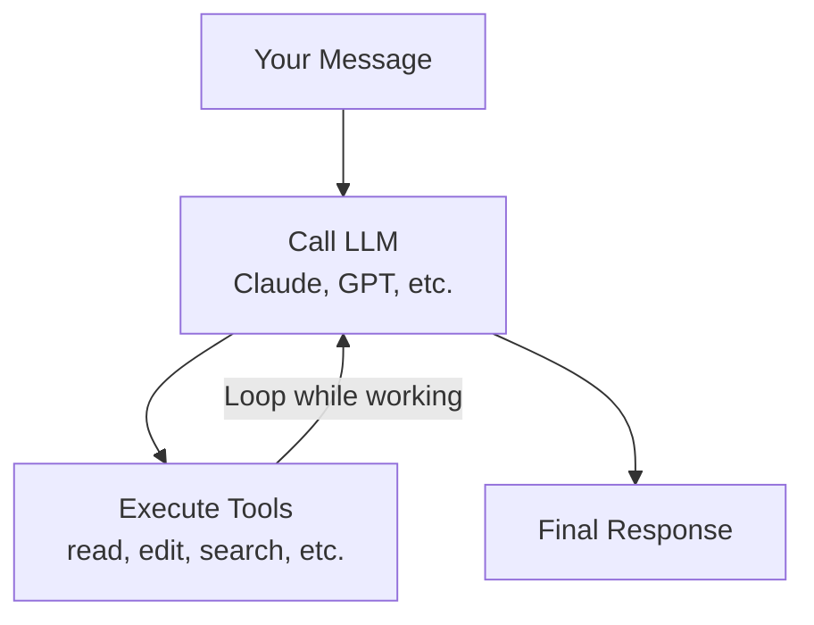

Everything in Reliant runs through workflows. Type a message, press enter, and you're triggering a workflow. The agent reads your codebase, executes tools, responds. That's a workflow.

A workflow is a programmable sequence of AI operations. It defines which tools the agent can use, how approvals work, when to loop, and when to stop.

## The Agent Workflow

The default experience in Reliant is itself a workflow called `builtin://agent`. When you chat, you're running this workflow.

Here's what happens when you send a message:

The workflow sends your message to the LLM. The LLM responds, possibly requesting tool calls—reading files, searching code, making edits. The workflow executes those tools and sends the results back to the LLM. This loop continues while the LLM has tool calls to execute. When the LLM responds without requesting more tools, the task is complete.

A single message like "add input validation to the signup form" might trigger dozens of iterations. The agent reads your codebase, identifies the relevant files, plans the changes, implements them, verifies they work. All within this loop.

## Execution Modes

The `mode` parameter controls how tool execution is handled. This is a regular workflow input you can set in the UI or in workflow YAML.

| Mode | Behavior | Good for |
|------|----------|----------|
| **Auto** | Auto-approves all tool calls. Press Escape to cancel. | Large refactors, trusted tasks, autonomous work |
| **Manual** | Requires your approval before each tool execution. | Learning Reliant, sensitive code, understanding what the agent is doing |
| **Plan** | Read-only tools only. Can view files and search, but no edits or commands. | Exploring unfamiliar code, creating a plan before executing it |

You can switch modes mid-conversation. A common pattern: start in plan mode to analyze and create a plan, then switch to auto to execute it.

## Running Workflows

Workflows appear in the workflow selector in the chat interface. The default `agent` workflow is pre-selected, but you can choose others—including custom workflows you've created or advanced built-in workflows for specific patterns like TDD or code review.

When you select a workflow, a parameters panel appears showing the configurable options:

| Parameter | Purpose |
|-----------|---------|
| `mode` | Execution mode (auto, manual, or plan) |
| `model` | Which LLM to use (Claude, GPT, etc.) |
| `temperature` | Response randomness (0 = focused, 1 = creative) |
| `thinking_level` | Extended thinking depth (low, medium, high, xhigh). `xhigh` is used on supporting models/providers and maps to the highest supported level elsewhere |
| `tools` | Which tools the agent can access |
| `spawn_presets` | Which presets are available for spawning sub-agents |

You can adjust these parameters before each conversation. A complex refactoring might warrant a higher thinking level and lower temperature, while brainstorming might benefit from higher temperature.

## Workflow Outputs

Workflows produce outputs that become available when the workflow completes. For the agent workflow, the primary outputs are:

- **message**: The final assistant message from the conversation
- **response_text**: The text content of that message

These outputs matter most when workflows are composed—when a parent workflow spawns child workflows and needs their results. The agent workflow's thread also contains the complete conversation history, which persists in your session for later reference or continuation.

## Beyond the Agent Workflow

While the agent workflow handles most tasks, Reliant includes additional workflows for specialized patterns:

**plan-debate** uses two agents: a proposer and a critic. The proposer suggests approaches, the critic identifies weaknesses, they iterate while disagreements remain.

**parallel-compete** runs three agents on the same problem, then a reviewer picks the best solution. Good for comparing implementation strategies (SQL vs NoSQL, algorithm choices).

**tdd-loop** implements test-driven development: write failing tests, implement while tests fail, refactor, repeat.

**ux-review** runs a UX improvement loop that takes screenshots, analyzes the UI, suggests improvements, and iterates with visual review.

**smart-route** is an intelligent workflow router that analyzes the user's request and dispatches to the best strategy — research, implementation, debugging, or another specialized workflow.

**one-ring** and **bmad-lite** are multi-phase pipeline workflows that use [node routers](/workflows/routing#node-routing) for phase skipping. Users can jump directly to the relevant phase (discuss, planning, implementation, etc.) based on their request.

For details on these patterns and how to build your own, see [Multi-Agent Patterns](/workflows/patterns).

## Related Topics

- [Multi-Agent Patterns](/workflows/patterns) - Advanced workflow patterns and composition
- [Presets](/workflows/presets) - Creating your own parameter configurations
- [Creating Custom Workflows](/workflows/custom-workflows) - Build your own workflows
- [Testing Workflows](/workflows/testing) - Validate structure and test runtime behavior