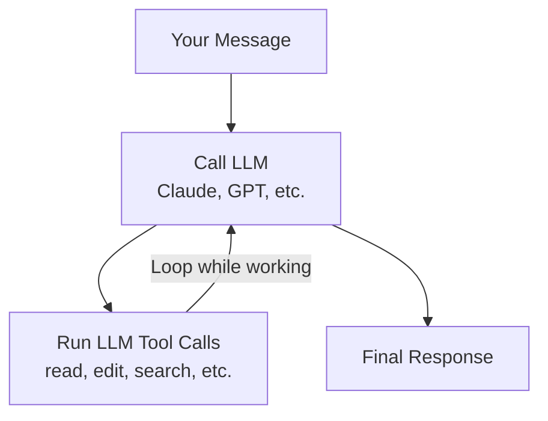

Everything in Reliant runs through workflows. Type a message, press enter, and you're triggering a workflow. The agent reads your codebase, executes tools, responds. That's a workflow.

A workflow is a programmable sequence of AI operations. It defines which tools the agent can use, how approvals work, when to loop, and when to stop.

## The Agent Workflow

The default experience in Reliant is itself a workflow called `builtin://agent`. When you chat, you're running this workflow.

Here's what happens when you send a message:

```mermaid
flowchart TD
    message[Your Message] --> llm[Call LLM<br/>Claude, GPT, etc.]
    llm --> tools[Run LLM Tool Calls<br/>read, edit, search, etc.]
    tools -->|Loop while working| llm
    llm --> done[Final Response]
```

The workflow sends your message to the LLM. The LLM responds, possibly requesting tool calls—reading files, searching code, making edits. The workflow executes those tools and sends the results back to the LLM. This loop continues while the LLM has tool calls to execute. When the LLM responds without requesting more tools, the task is complete.

A single message like "add input validation to the signup form" might trigger dozens of iterations. The agent reads your codebase, identifies the relevant files, plans the changes, implements them, verifies they work. All within this loop.

## Execution Modes

The `mode` parameter controls how tool execution is handled. This is a regular workflow input you can set in the UI or in workflow YAML.

| Mode | Behavior | Good for |
|------|----------|----------|
| **Auto** | Auto-approves all tool calls. Press Escape to cancel. | Large refactors, trusted tasks, autonomous work |
| **Manual** | Requires your approval before each tool execution. | Learning Reliant, sensitive code, understanding what the agent is doing |
| **Plan** | Read-only tools only. Can view files and search, but no edits or commands. | Exploring unfamiliar code, creating a plan before executing it |

You can switch modes mid-conversation. A common pattern: start in plan mode to analyze and create a plan, then switch to auto to execute it.

## Running Workflows

Workflows appear in the workflow selector in the chat interface. The default `agent` workflow is pre-selected, but you can choose others—including custom workflows you've created or advanced built-in workflows for specific patterns like TDD or code review.

When you select a workflow, a parameters panel appears showing the configurable options:

| Parameter | Purpose |
|-----------|---------|
| `mode` | Execution mode (auto, manual, or plan) |
| `model` | Which LLM to use (Claude, GPT, etc.) |
| `temperature` | Response randomness (0 = focused, 1 = creative) |
| `thinking_level` | Extended thinking depth (low, medium, high, xhigh). `xhigh` is used on supporting models/providers and maps to the highest supported level elsewhere |
| `tools` | Which tools the agent can access |
| `spawn_presets` | Which presets are available for spawning sub-agents |

You can adjust these parameters before each conversation. A complex refactoring might warrant a higher thinking level and lower temperature, while brainstorming might benefit from higher temperature.

## Workflow Outputs

Workflows produce outputs that become available when the workflow completes. For the agent workflow, the primary outputs are:

- **message**: The final assistant message from the conversation
- **response_text**: The text content of that message

These outputs matter most when workflows are composed—when a parent workflow spawns child workflows and needs their results. The agent workflow's thread also contains the complete conversation history, which persists in your session for later reference or continuation.

## Beyond the Agent Workflow

While the agent workflow handles most tasks, Reliant ships additional workflows for specialized jobs. The selector shows each one's display name; the identifier in parentheses is what you use in a `ref:` or on the command line (`reliant workflow run <name>`).

**Get It Right** (`get-it-right`) is for complex changes in an existing codebase, where a first attempt often fails. Each iteration implements, runs lint/test/build checks in parallel, then reviews. A failed check skips review and loops straight back; a bad attempt is undone before the next one. Many of the workflows below are built on it.

**Best of Three** (`parallel-compete`) runs three agents on the same task in isolated worktrees, then a reviewer picks the winner or synthesizes the best parts. Good for comparing implementation strategies.

**Build an App** (`forge-one-shot`) scopes an app with you, scaffolds it with Forge, gets the build green, then fans out sub-agents per part of the app and verifies the running result.

**Move to Forge** (`forge-migrate`) migrates an existing codebase into a Forge project, with an approval checkpoint before it starts porting components one at a time.

**Landing Page** (`landing-page`) and **Pitch Deck** (`pitch-deck`) are content pipelines: a short scoping conversation, a content review loop, a visual review loop, then a handoff that serves the result at a preview URL. When they finish, the chat switches to a plain agent so you can keep iterating.

**Create a Workflow** (`build-workflow`) turns a conversation about what you want to automate into a workflow, building and testing any integrations it needs first.

**Import from Claude Code / Cursor** (`migrate`) brings configuration across from Claude Code, Cursor, Codex, or Windsurf.

Two more ship as **building blocks**: `structured-agent` (an agent that must answer through a response tool, for structured output) and `scope-conversation` (a reusable scoping conversation). They're hidden from the workflow selector, but any workflow can `ref:` them, and they appear under *Building blocks* in the workflow library.

Multi-phase pipeline workflows can use [node routers](/workflows/routing#node-routing) for phase skipping, letting users jump directly to the relevant phase (planning, implementation, etc.) based on their request.

For patterns you can build yourself, such as plan debates, TDD loops, and triage routers, see [Multi-Agent Patterns](/workflows/patterns).

## Related Topics

- [Multi-Agent Patterns](/workflows/patterns) - Advanced workflow patterns and composition
- [Presets](/workflows/presets) - Creating your own parameter configurations
- [Creating Custom Workflows](/workflows/custom-workflows) - Build your own workflows
- [Testing Workflows](/workflows/testing) - Validate structure and test runtime behavior