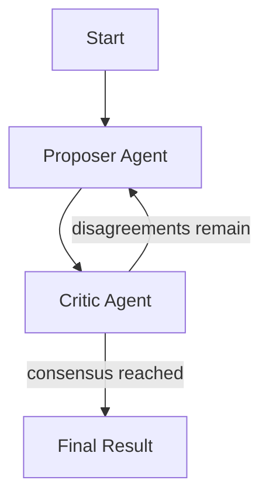
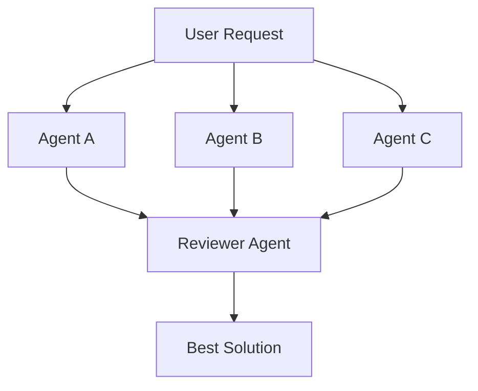

This guide covers techniques for building sophisticated workflows. Focus is on the patterns themselves so you can combine them to fit your needs.

## Agent Variants

The standard agent loop (call LLM → execute tools → repeat) can be customized in several ways.

### Custom Approval Logic

Control when tools require approval using mode and conditional edges:

```yaml
edges:
  - from: call_llm
    cases:
      - to: approval
        condition: size(nodes.call_llm.tool_calls) > 0 && inputs.mode == 'manual'
      - to: execute_tools
        condition: size(nodes.call_llm.tool_calls) > 0 && inputs.mode != 'manual'
```

**When to use:** Human oversight for certain operations, or letting users toggle between autonomous and supervised modes.

### Context Management

Long-running agents accumulate large contexts. Two techniques help:

**Compaction** summarizes the conversation when it exceeds a threshold:

```yaml
- id: compact
  action: Compact
  inputs:

edges:
  - from: execute_tools
    cases:
      - to: compact
        condition: nodes.execute_tools.thread_token_count > inputs.compaction_threshold
```

**Result filtering** uses a secondary LLM call to extract only relevant information from large tool results:

```yaml
- id: filter_results
  action: CallLLM
  inputs:
    tools: false
    ephemeral: true
    system_prompt: |
      Extract only information relevant to completing the task.
      Keep: file paths, line numbers, error messages, relevant code.
      Remove: verbose output, boilerplate, irrelevant content.
    messages:
      - role: user
        content: |
          Tool calls: {{toJson(nodes.call_llm.tool_calls)}}
          Results: {{toJson(nodes.execute_tools.tool_results)}}

edges:
  - from: execute_tools
    cases:
      - to: filter_results
        condition: nodes.execute_tools.total_result_chars > 4000
```

**When to use:** Compaction for long-running agents. Result filtering when tools frequently return large outputs.

### Oversight and Auditing

Add a secondary agent that reviews the primary agent's actions before execution:

```yaml
nodes:
  - id: main_agent
    action: CallLLM
    inputs:

  - id: audit_check
    action: CallLLM
    inputs:
      tool_filter: [audit_result]
      response_tool:
        name: audit_result
        description: Report audit findings
        schema:
          type: object
          required: [choice, value]
          properties:
            choice:
              type: string
              enum: [approved, denied]
              description: |
                Choose one:
                - approved: Agent is on track - provide brief confirmation
                - denied: Agent needs guidance - explain what is wrong and how to fix it
            value:
              type: string
              description: Explanation for your choice
      messages:
        - role: user
          content: |
            Task: {{inputs.task}}
            Agent response: {{nodes.main_agent.response_text}}
            Use audit_result to report whether the agent is on track.

  - id: execute_audit
    action: ExecuteTools
    inputs:
      tool_calls: "{{nodes.audit_check.tool_calls}}"

edges:
  - from: execute_audit
    cases:
      - to: execute_tools
        condition: nodes.execute_audit.response_data.audit_result.choice == 'approved'
      - to: guidance
        condition: nodes.execute_audit.response_data.audit_result.choice == 'denied'
```

The `response_tool` feature creates structured output you can branch on. The tool defines a JSON `schema` for the expected output format. A common pattern uses `choice` (enum) and `value` (explanation) properties. Response data is available via `nodes.<execute_tools_node>.response_data.<tool_name>`. If the audit fails, use `.value` to get the guidance and inject it for the primary agent to try again.

**When to use:** High-stakes tasks, compliance requirements, or when a cheaper model should validate an expensive model's decisions.

### Tool Restrictions

Control available tools based on mode using `tool_filter`:

```yaml
- id: call_llm
  action: CallLLM
  inputs:
    tool_filter: "{{inputs.mode == 'plan' ? ['tag:readonly'] : inputs.tools}}"
```

Filter options: tags (`['tag:default']`), specific tools (`['view', 'grep']`), or exclusions.

**When to use:** Planning modes (read-only), sandboxed exploration, role-specific tool access.

### Structured Output with Response Tools

Response tools force the LLM to produce structured output you can programmatically use for routing, classification, or data extraction.

**Simple options-based response:**

```yaml
- id: classify
  action: CallLLM
  inputs:
    response_tool:
      name: classification
      description: Classify the user's request
      options:
        bug_report: "User is reporting a bug"
        feature_request: "User wants a new feature"
        question: "User has a question"
        other: "Doesn't fit other categories"

- id: execute_classify
  action: ExecuteTools
  inputs:
    tool_calls: "{{nodes.classify.tool_calls}}"

edges:
  - from: classify
    default: execute_classify
  - from: execute_classify
    cases:
      - to: handle_bug
        condition: nodes.execute_classify.response_data.classification.choice == 'bug_report'
      - to: handle_feature
        condition: nodes.execute_classify.response_data.classification.choice == 'feature_request'
    default: handle_question
```

**Output structure:** Options-based response tools always return:

```json
{
  "choice": "bug_report",
  "value": "User describes a crash when clicking submit button."
}
```

**Advanced JSON schema response:**

For complex structured data, use a full JSON schema:

```yaml
response_tool:
  name: code_review
  description: Submit code review findings
  schema:
    type: object
    required: [verdict, confidence, findings]
    properties:
      verdict:
        type: string
        enum: [approve, request_changes, comment]
      confidence:
        type: integer
        minimum: 1
        maximum: 10
      findings:
        type: array
        items:
          type: object
          properties:
            severity:
              type: string
              enum: [critical, major, minor, suggestion]
            file:
              type: string
            line:
              type: integer
            message:
              type: string
```

**Key points:**

1. **ExecuteTools required** — You must execute the tool call to access `response_data`
2. **Access path** — `nodes.<execute_node>.response_data.<tool_name>.<field>`
3. **LLM must call it** — The response tool is the only way to complete; LLM cannot just respond with text
4. **Use for routing** — Perfect for decisions that control workflow branching

**When to use:** Classification, routing decisions, structured data extraction, code reviews, approval workflows.

---

## Pipelines

Sequential multi-node workflows where each node builds on previous results.

### Running Steps After Agent Completes

Use edges to route from an agent's completion to the next node:

```yaml
nodes:
  - id: implement
    workflow: builtin://agent

  - id: lint
    run: make lints

  - id: test
    run: make test

edges:
  - from: implement
    default: lint
  - from: lint
    default: test
```

### Chaining Outputs

Reference previous node outputs using `nodes.<node_id>.<field>`:

```yaml
- id: implement
  workflow: builtin://agent
  thread:
    inject:
      role: user
      content: |
        TASK: {{nodes.improve_prompt.message.text}}
        Working directory: {{nodes.create_worktree.path}}
```

Common fields: `message.text`, `exit_code`, `stdout`, `stderr`, `path`, `tool_results`.

### Conditional Next Steps

Branch based on results:

```yaml
edges:
  - from: lint
    cases:
      - to: test
        condition: nodes.lint.exit_code == 0
      - to: fix_lint
        condition: nodes.lint.exit_code != 0
```

Branch on: exit codes, tool calls (`size(nodes.X.tool_calls) > 0`), loop output conditions, custom outputs.

### Verification Loops

Repeat while a condition is true using `loop`:

```yaml
- id: implement_loop
  loop:
    while: outputs.exit_code != 0 && iter.iteration < 3
    inline:
      entry: [implement]
      outputs:
        exit_code: "{{nodes.verify.exit_code}}"
        stderr: "{{nodes.verify.stderr}}"
      nodes:
        - id: implement
          workflow: builtin://agent
          thread:
            mode: inherit  # Agent sees full history including previous errors
            inject:
              role: user
              content: "{{inputs.task}}"
        - id: verify
          run: make test
      edges:
        - from: implement
          default: verify
```

Key loop features: `while` (continue condition with iteration limits), `iter.iteration` (current iteration, 0-indexed), `outputs.*` (current iteration's results in while condition).

**Outputs requirement:** When using `outputs.*` in the `while` condition, you must declare an `outputs` section in the inline workflow that maps inner node outputs to named fields. This creates a clear contract between the loop body and the while condition:

```yaml
inline:
  outputs:
    tool_calls: "{{nodes.call_llm.tool_calls}}"
    exit_code: "{{nodes.verify.exit_code}}"
  nodes:
    ...
```

Without the `outputs` section, the `while` condition receives raw inner node outputs keyed by node ID (for example, `outputs.call_llm.tool_calls` instead of `outputs.tool_calls`), which is fragile and makes refactoring difficult.

**Do-while semantics:** The loop always runs at least once. After each iteration, `iter.iteration` increments before the `while` condition is checked.

**Iteration counting:** In the loop body, `iter.iteration` is 0-indexed (0, 1, 2...). In the `while` check, it reflects completed iterations (1 after first, 2 after second). Use `iter.iteration < N` to run exactly N iterations.

**When to use:** Test-driven development, retry-while-failing, iterative refinement.

---

## Multi-Agent Coordination



Multiple agents working together, either in parallel or alternating.

### Parallel Execution with Join



Launch multiple agents simultaneously, then wait for all to complete:

```yaml
nodes:
  - id: impl_1
    workflow: builtin://agent
    thread:
      mode: new
      inject:
        role: user
        content: "Implement in {{nodes.create_worktree_1.path}}"

  - id: impl_2
    workflow: builtin://agent
    thread:
      mode: new

  - id: implementations_done
    join: all

edges:
  - from: start
    default: [impl_1, impl_2]
  - from: impl_1
    default: implementations_done
  - from: impl_2
    default: implementations_done
```

The `join: all` node waits until all incoming edges complete. Use worktrees for isolated working directories.

**When to use:** Competitive implementations, exploring multiple approaches, reducing wall-clock time.

### Turn-Taking (Proposer/Critic)

Alternating agents on the same thread see each other's work:

```yaml
- id: debate_loop
  loop:
    while: iter.iteration < inputs.rounds
    inline:
      entry: [proposer_turn]
      nodes:
        - id: proposer_turn
          workflow: builtin://agent
          thread: { mode: inherit }
          inputs:
            system_prompt: "You are the PROPOSER. Create and refine plans."

        - id: critic_turn
          workflow: builtin://agent
          thread:
            mode: inherit
            inject:
              role: user
              content: "Challenge this plan: What could go wrong?"
          inputs:
            system_prompt: "You are the CRITIC. Find flaws and risks."

      edges:
        - from: proposer_turn
          default: critic_turn
```

**When to use:** Planning/design review, stress-testing ideas, multi-perspective quality improvement.

### Thread Isolation vs Shared Context

See [Threads](/features/threads) for complete documentation on thread modes (`new`, `inherit`, `fork`).

The `inject` option adds a message when entering the node:

```yaml
thread:
  mode: inherit
  inject:
    role: user
    content: "Now review what was done above."
```

### Different Models Per Agent

Use `groups` to configure different settings for different roles:

```yaml
groups:
  Implementer:
    inputs:
      model: { type: model, default: { tags: [moderate] } }
  Reviewer:
    inputs:
      model: { type: model, default: { tags: [flagship] } }

nodes:
  - id: impl
    workflow: builtin://agent
    inputs:
      model: "{{inputs.Implementer.model}}"
  - id: review
    workflow: builtin://agent
    inputs:
      model: "{{inputs.Reviewer.model}}"
```

**When to use:** Cheaper models for routine work, expensive for complex decisions.

---

## Combining Techniques

These techniques compose naturally. A sophisticated workflow might combine: pipeline (improve prompt → implement → verify), parallel execution in isolated worktrees, retry loops while tests fail, escalation to senior agent on failure, and multi-model review.

Start simple. A basic agent with compaction handles most tasks. Add verification loops for reliability, parallelism for exploration, and auditing for oversight.

See [Examples](/examples) for complete workflow files.