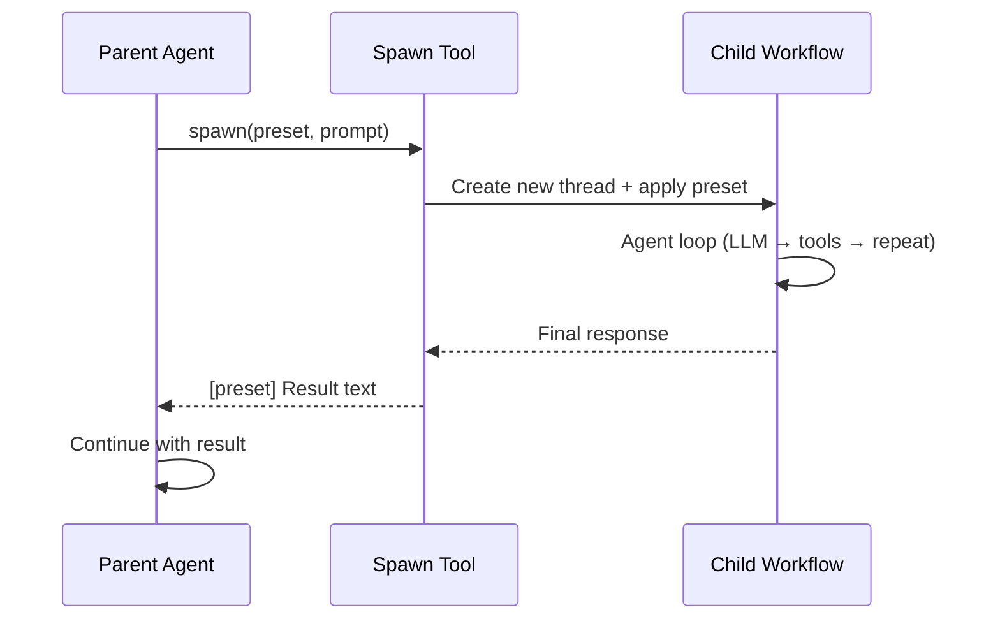

The spawn tool allows an agent to delegate tasks to sub-workflows during execution. When an agent encounters a task better suited for a specialist, it can spawn a sub-workflow configured with a specific preset, wait for the result, and continue with its work.

Think of spawn as "asking a specialist for help." The parent agent describes what needs to be done, the spawned workflow does the work in isolation, and the result comes back to the parent agent as a tool response.

## Important Limitations

Before diving into configuration, understand what spawn can and cannot do:

**Current constraints:**

- **Single workflow target**: Spawn only supports `builtin://agent` as the target workflow. You cannot spawn arbitrary custom workflows.
- **Preset selection only**: The spawned workflow must be configured via a preset. You cannot pass arbitrary parameters or override individual settings.
- **Self-contained tasks**: The spawned workflow runs in its own thread with its own context. It cannot access the parent's conversation history or tool results directly—it only receives the prompt you provide.
- **Sequential by default**: While spawn tool calls execute in parallel with regular tool calls, each spawn creates an independent workflow that must complete before its result returns.

These limitations exist by design. Spawn provides a controlled way to delegate work while maintaining isolation between parent and child workflows.

## How Spawn Works

When an agent calls the spawn tool:

1. **New thread created**: The spawned workflow gets its own conversation thread, completely separate from the parent.
2. **Preset applied**: The selected preset configures the child agent's model, temperature, tools, and system prompt.
3. **Task executed**: The child workflow runs until completion, following the same agent loop pattern as any other agent workflow.
4. **Result returned**: The final response from the child workflow returns to the parent as a tool result, prefixed with the preset name for clarity.

The parent agent can then use this result to inform its next steps.



## Configuring Spawn

Spawn availability is controlled by the `spawn_presets` input in workflows that use the agent loop. This input determines which presets appear as options in the spawn tool.

### The spawn_presets Input

In the built-in agent workflow, `spawn_presets` is configured as a multi-select enum:

```yaml
spawn_presets:
  type: enum
  multi: true
  enum:
    - general
    - researcher
    - planner
    - reviewer
    - documentation
    - refactor
    - debug
    - tester
    - reproducer
    - git
    - ux
    - workflow_builder
    - auditor
  default:
    - general
    - researcher
    - reviewer
  description: Presets available for spawn tool (empty = spawn disabled)
```

The key points:

- **Empty selection disables spawn**: If no presets are selected, the spawn tool does not appear in the agent's toolset.
- **Default includes common presets**: By default, agents can spawn general, researcher, and reviewer sub-workflows.
- **Enum values must be valid presets**: Each value must correspond to a preset that exists, built-in or custom.

### Tool Filter Syntax

Behind the scenes, spawn configuration flows through the tool filter system. The spawn filter syntax is:

```text
spawn:builtin://agent(preset1,preset2,preset3)
```

For example, the agent workflow builds its tool filter using the `spawn()` CEL function:

```yaml
tool_filter: "{{inputs.tools + [spawn(workflow.name, inputs.spawn_presets)]}}"
```

The `spawn()` function takes a workflow reference and a list of presets, returning the spawn filter spec string. If the presets list is empty, it returns an empty string, disabling spawn.

### Disabling Spawn

To disable spawn entirely:

**Via UI**: Deselect all presets in the `spawn_presets` parameter.

**Via workflow configuration**: Omit the spawn filter or use empty presets:

```yaml
# Spawn disabled - empty presets
tool_filter:
  - tag:default
  - spawn:builtin://agent()  # Empty parens = disabled
```

Or simply do not include any spawn filter:

```yaml
# Spawn disabled - no spawn filter at all
tool_filter:
  - tag:default
```

## Spawn Tool Parameters

When an agent has access to spawn, the tool accepts these parameters:

| Parameter | Required | Description |
|-----------|----------|-------------|
| `preset` | Yes | Name of the preset to use and it must be in the allowed list |
| `prompt` | Yes | Detailed task description for the spawned workflow |
| `agent_id` | No | Agent ID to resume an existing conversation |
| `worktree` | No | Worktree name to run this workflow in |
| `create_worktree` | No | Configuration to create a new worktree |

### Basic Example

```json
{
  "preset": "researcher",
  "prompt": "Investigate how authentication is implemented in this codebase. Find all authentication-related files, understand the flow from login to session validation, and document the key components involved."
}
```

### Resuming a Previous Agent

If a spawned agent was previously used, you can resume its conversation:

```json
{
  "preset": "researcher",
  "prompt": "Continue investigating the authentication flow. Now focus on how tokens are refreshed.",
  "agent_id": "previously-returned-agent-id"
}
```

### Running in a Worktree

For tasks that modify files, you can isolate changes in a worktree:

```json
{
  "preset": "refactor",
  "prompt": "Rename the UserService class to AccountService throughout the codebase.",
  "create_worktree": {
    "name": "refactor-user-service",
    "base_branch": "main"
  }
}
```

## Use Cases

### Research Before Implementation

Spawn a researcher to investigate before making changes:

```text
Agent receives: "Add caching to the database queries"

Agent thinks: "I should understand the current database architecture first"

Agent spawns researcher:
  preset: researcher
  prompt: "Analyze the database query patterns in this codebase. Find where queries are made, identify any existing caching, and document the query hot spots that would benefit from caching."

Result returns with comprehensive analysis

Agent proceeds with implementation using the research findings
```

### Specialized Code Review

Get focused feedback from a specialist:

```text
Agent receives: "Review my changes to the authentication module"

Agent spawns reviewer:
  preset: reviewer
  prompt: "Review the recent changes to the auth/ directory. Focus on security implications, error handling, and whether the changes follow the existing patterns in the codebase."

Result returns with structured review feedback

Agent summarizes findings for the user
```

### Breaking Down Complex Tasks

Delegate subtasks to specialists:

```text
Agent receives: "Modernize the user management system"

Agent creates a plan, then for each major component:

Agent spawns refactor for UserService cleanup
Agent spawns researcher to investigate external integrations
Agent spawns documentation to update API docs

Each specialist completes their portion

Agent synthesizes results and reports overall progress
```

### Parallel Independent Tasks

When tasks do not depend on each other, spawn can run in parallel with other tool calls:

```text
Agent needs to:
1. Search for related files (grep tool)
2. Get research on a component (spawn researcher)
3. Check test coverage (bash tool)

All three execute concurrently, results return together
```

## What Gets Returned

The spawn tool returns the final response from the child workflow, prefixed to indicate the source:

```text
[researcher] Based on my investigation of the authentication system...

The codebase uses JWT tokens with the following flow:
1. Login endpoint in auth/handlers.go creates tokens
2. Middleware in auth/middleware.go validates on each request
3. Refresh logic in auth/refresh.go handles token renewal

Key files:
- auth/handlers.go:45-120 - Login and logout handlers
- auth/middleware.go:20-80 - Token validation middleware
- auth/models.go:10-50 - Token structures and claims
```

If the child workflow encounters an error, the error message returns as the tool result with an `is_error` flag.

## Best Practices

**Write detailed prompts**: The spawned workflow only knows what you tell it. Include context about what you are trying to accomplish, what you have already learned, and what specific questions need answering.

**Choose appropriate presets**: Match the task to the specialist. Use researcher for investigation, reviewer for quality feedback, refactor for systematic changes.

**Handle results appropriately**: The spawn result is just information. The parent agent should interpret the findings and decide what to do next.

**Do not over-delegate**: Simple tasks do not need spawn. Use spawn when the task benefits from a specialist's focused attention or when you want isolation between concerns.

**Consider worktrees for modifications**: When spawning workflows that will modify files, consider using worktrees to isolate changes until you are ready to merge them.

## Related Topics

- [Presets](/workflows/presets) - Understanding the presets that configure spawned workflows
- [Worktrees & Workspaces](/features/worktrees) - Isolating file changes in separate working directories
- [Multi-Agent Patterns](/workflows/patterns) - Broader patterns for coordinating multiple agents